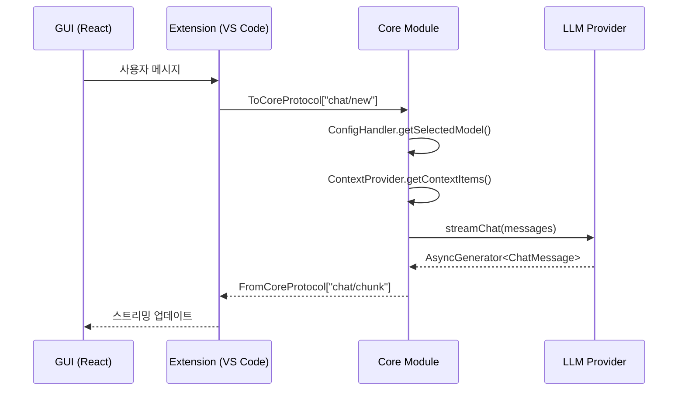
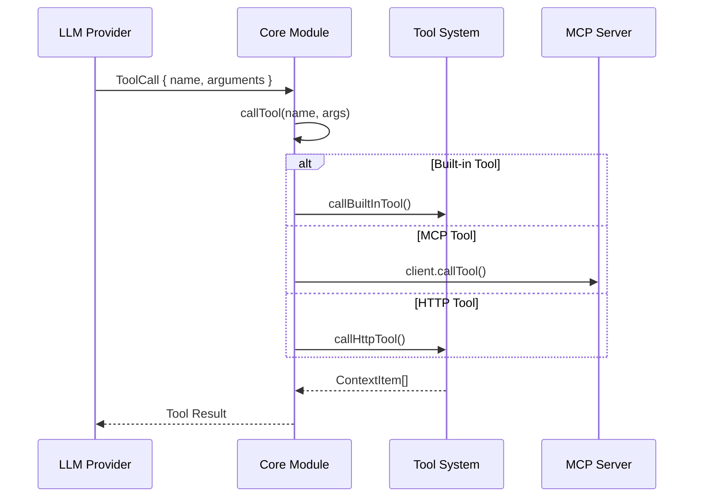

# Continue 프로젝트 개요

> **목적**: Continue 프로젝트의 전체 아키텍처와 모듈 구조를 분석하여 hdsp-agent 개발에 활용할 핵심 인사이트 제공

---

## 1. Continue 프로젝트 소개

Continue는 **오픈소스 AI 코딩 어시스턴트**로, VS Code와 JetBrains IDE에서 동작하는 확장 프로그램입니다. 76개 이상의 LLM 프로바이더를 지원하며, MCP(Model Context Protocol)를 통해 외부 도구와 통합됩니다.

### 핵심 특징
- **다중 LLM 지원**: OpenAI, Anthropic, Ollama, Bedrock 등 76+ 프로바이더
- **4가지 메시지 모드**: Chat, Agent, Plan, Background
- **확장 가능한 컨텍스트**: 39개 내장 Context Provider + MCP 통합
- **IDE 통합**: VS Code, JetBrains, CLI 지원

---

## 2. 모노레포 구조

```
continue/
├── core/                    # 핵심 비즈니스 로직 (npm: @continuedev/core)
│   ├── llm/                 # LLM 추상화 및 76+ 프로바이더
│   ├── protocol/            # 타입 안전 RPC 프로토콜
│   ├── tools/               # 도구 정의 및 실행
│   ├── context/             # 컨텍스트 제공자 및 MCP
│   ├── config/              # 설정 관리
│   └── autocomplete/        # 자동완성 시스템
│
├── extensions/              # IDE 확장
│   ├── vscode/              # VS Code 확장
│   ├── intellij/            # JetBrains 확장 (Kotlin)
│   └── cli/                 # CLI 도구
│
├── gui/                     # React 기반 웹뷰 UI
│   ├── src/components/      # React 컴포넌트
│   └── src/redux/           # 상태 관리
│
├── binary/                  # 독립 실행형 바이너리
│   └── src/                 # IPC/TCP 메신저
│
└── packages/                # 공유 패키지
    ├── config-yaml/         # YAML 설정 파싱
    ├── config-types/        # 타입 정의
    ├── openai-adapters/     # OpenAI SDK 어댑터
    ├── fetch/               # HTTP 클라이언트
    └── llm-info/            # LLM 모델 정보
```

---

## 3. 핵심 모듈 역할

### 3.1 Core 모듈 (`/core`)

전체 비즈니스 로직을 담당하는 핵심 라이브러리입니다.

```typescript
// core/core.ts - 메인 오케스트레이션 클래스 (48KB)
class Core {
  configHandler: ConfigHandler;      // 설정 관리
  codebaseIndexer: CodebaseIndexer;  // 코드베이스 인덱싱
  completionProvider: CompletionProvider;  // 자동완성

  // 프로토콜 메시지 핸들러
  on(messageType: string, handler: MessageHandler): void;

  // LLM 스트리밍 채팅
  async *streamChat(messages: ChatMessage[]): AsyncGenerator<ChatMessage>;
}
```

**주요 하위 모듈**:

| 디렉토리 | 크기 | 역할 |
|---------|------|------|
| `llm/` | 43KB+ | LLM 추상화, 76+ 프로바이더 |
| `protocol/` | - | RPC 메시지 타입, 메신저 |
| `tools/` | 7KB+ | 도구 정의, 실행 파이프라인 |
| `context/` | 19KB+ | 컨텍스트 제공자, MCP |
| `config/` | 20KB+ | 설정 로딩, 검증 |
| `autocomplete/` | - | 자동완성 컨텍스트, 생성 |

### 3.2 Extensions 모듈 (`/extensions`)

IDE별 확장 구현체입니다.

```typescript
// extensions/vscode/src/extension.ts - VS Code 진입점
export async function activate(context: ExtensionContext) {
  // 1. Core 인스턴스 생성
  const core = new Core(config);

  // 2. IDE 인터페이스 구현
  const ide = new VsCodeIde(context);

  // 3. 웹뷰 프로바이더 등록
  const provider = new ContinueGUIWebviewViewProvider(core, ide);
  context.subscriptions.push(
    window.registerWebviewViewProvider('continue.continueGUIView', provider)
  );
}
```

### 3.3 GUI 모듈 (`/gui`)

React + Vite + Tailwind 기반의 사이드바 UI입니다.

```typescript
// gui/src/App.tsx - React 루트 컴포넌트
function App() {
  return (
    <Provider store={store}>
      <ChatPanel />
      <ToolsPanel />
      <SettingsPanel />
    </Provider>
  );
}
```

### 3.4 Packages (`/packages`)

재사용 가능한 공유 패키지입니다.

| 패키지 | 용도 |
|--------|------|
| `@continuedev/config-yaml` | YAML 설정 파싱 |
| `@continuedev/openai-adapters` | OpenAI SDK 호환 어댑터 |
| `@continuedev/fetch` | 프록시/인증 지원 HTTP 클라이언트 |
| `@continuedev/llm-info` | LLM 모델 정보 데이터베이스 |

---

## 4. 데이터 플로우

### 4.1 채팅 요청 플로우



### 4.2 도구 호출 플로우



---

## 5. 아키텍처 패턴 요약

Continue는 다음 핵심 패턴을 사용합니다:

### 5.1 Protocol-Based Architecture
IDE와 Core 간 통신을 타입 안전 프로토콜로 정의합니다.

```typescript
// core/protocol/core.ts
type ToCoreFromIdeOrWebviewProtocol = {
  "history/list": [ListHistoryOptions, BaseSessionMetadata[]];
  "context/getContextItems": [ContextRequest, ContextItemWithId[]];
  "mcp/reloadServer": [{ id: string }, void];
  // ...
};
```

### 5.2 Provider Pattern
LLM과 Context를 확장 가능한 인터페이스로 추상화합니다.

```typescript
// 76개 LLM 프로바이더가 BaseLLM 상속
abstract class BaseLLM implements ILLM {
  abstract streamChat(messages: ChatMessage[]): AsyncGenerator<ChatMessage>;
}

// 39개 컨텍스트 제공자가 IContextProvider 구현
interface IContextProvider {
  getContextItems(query: string): Promise<ContextItem[]>;
}
```

### 5.3 Factory Pattern
설정 기반으로 프로바이더를 동적 생성합니다.

```typescript
// core/llm/llms/index.ts
function llmFromDescription(desc: ModelDescription): BaseLLM {
  const ProviderClass = LLM_PROVIDER_MAP[desc.provider];
  return new ProviderClass(desc.options);
}
```

### 5.4 Async Generator Pattern
스트리밍 응답을 효율적으로 처리합니다.

```typescript
async function* streamChatResponse(
  llm: ILLM,
  messages: ChatMessage[]
): AsyncGenerator<ChatMessage, PromptLog> {
  for await (const chunk of llm.streamChat(messages)) {
    yield chunk;
  }
  return promptLog;
}
```

---

## 6. hdsp-agent 적용 인사이트

### 6.1 직접 적용 가능한 패턴

| 패턴 | Continue 구현 | hdsp-agent 적용 |
|------|--------------|----------------|
| LLM 추상화 | `BaseLLM` 클래스 | Jupyter Kernel 내 LLM 클라이언트 |
| Tool Calling | JSON Schema 기반 | Jupyter 매직 커맨드 연동 |
| 스트리밍 | Async Generator | Jupyter Comm 스트리밍 |
| MCP 통합 | `MCPConnection` | 동일하게 적용 가능 |

### 6.2 재설계 필요 영역

```
┌─────────────────────────────────────────────────────────────┐
│                     Continue                                │
│  ┌─────────┐   ┌──────────┐   ┌──────────────────────┐    │
│  │ VS Code │◄──│ Protocol │──►│       Core           │    │
│  │Extension│   │  (IPC)   │   │ (LLM, Tools, Context)│    │
│  └─────────┘   └──────────┘   └──────────────────────┘    │
└─────────────────────────────────────────────────────────────┘

┌─────────────────────────────────────────────────────────────┐
│                     hdsp-agent                              │
│  ┌─────────┐   ┌──────────┐   ┌──────────────────────┐    │
│  │ Jupyter │◄──│  Comm    │──►│       Core           │    │
│  │Extension│   │(Kernel)  │   │ (LLM, Tools, Context)│    │
│  └─────────┘   └──────────┘   └──────────────────────┘    │
└─────────────────────────────────────────────────────────────┘
```

### 6.3 구현 우선순위

1. **Phase 1**: Core 로직 포팅 (LLM, Tools)
2. **Phase 2**: Jupyter Comm 기반 프로토콜 구현
3. **Phase 3**: 익스텐션 UI 개발
4. **Phase 4**: MCP 통합

---

## 7. 참고 파일

| 파일 | 용도 |
|------|------|
| `core/core.ts` | 메인 오케스트레이션 |
| `core/llm/index.ts` | LLM 추상화 |
| `core/protocol/core.ts` | 프로토콜 타입 |
| `core/config/ConfigHandler.ts` | 설정 관리 |
| `extensions/vscode/src/extension.ts` | VS Code 진입점 |
| `gui/src/App.tsx` | React UI 루트 |

---

*다음 문서: [02-LLM-통합-패턴.md](./02-LLM-통합-패턴.md)*
