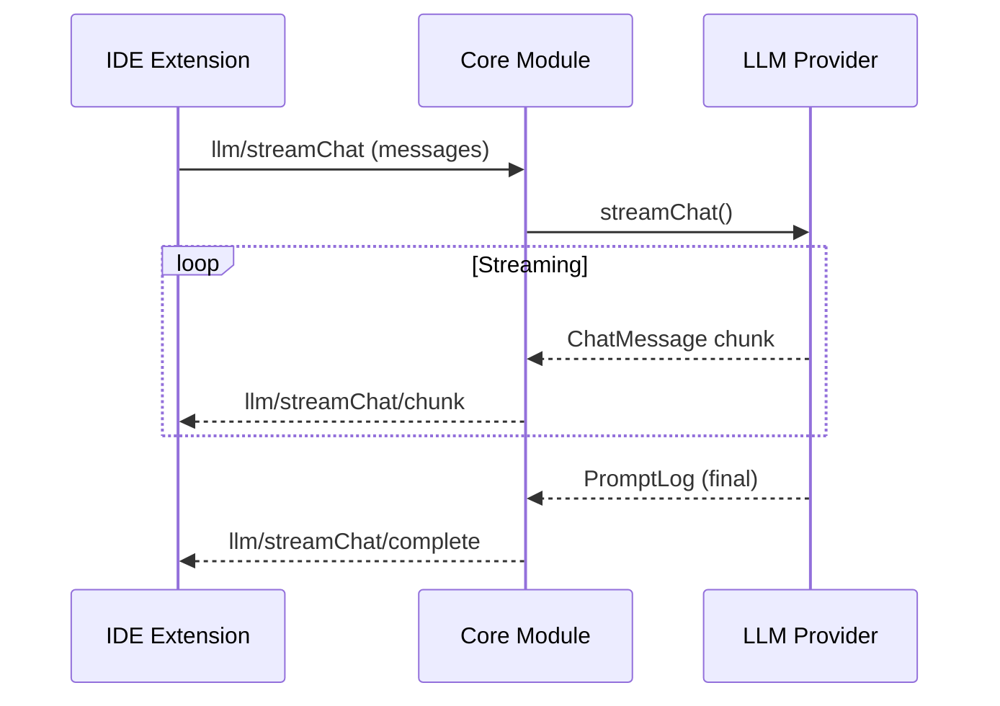

# 프로토콜 기반 통신

> **목적**: Continue의 타입 안전 RPC 프로토콜과 메신저 추상화를 분석하여 hdsp-agent의 Jupyter Comm 기반 통신 설계에 활용

---

## 1. 개요

Continue는 IDE 확장과 Core 모듈 간 통신을 위해 **타입 안전 프로토콜**을 사용합니다. 이 패턴은 컴파일 타임에 메시지 타입을 검증하여 런타임 오류를 방지합니다.

### 핵심 파일
- `core/protocol/core.ts` - 프로토콜 메시지 타입 정의
- `core/protocol/messenger/` - 메신저 추상화 레이어
- `core/index.d.ts` - 공통 타입 정의
- `binary/src/IpcMessenger.ts` - IPC 메신저 구현

---

## 2. 프로토콜 타입 정의

### 2.1 ToCoreProtocol (IDE → Core)

IDE에서 Core로 보내는 모든 메시지 타입입니다.

```typescript
// core/protocol/core.ts
export type ToCoreFromIdeOrWebviewProtocol = {
  // 특수 메시지
  ping: [string, string];
  abort: [undefined, void];
  cancelApply: [undefined, void];

  // 히스토리 관리
  "history/list": [ListHistoryOptions, BaseSessionMetadata[]];
  "history/delete": [{ id: string }, void];
  "history/load": [{ id: string }, Session];
  "history/save": [Session, void];

  // 설정 관리
  "config/addModel": [{ model: ModelConfig; role?: ModelRole }, void];
  "config/deleteModel": [{ title: string }, void];
  "config/ideSettingsUpdate": [IdeSettings, void];
  "config/updateSelectedModel": [
    { profileId: string; role: ModelRole; title: string | null },
    GlobalContextModelSelections,
  ];

  // 컨텍스트 제공자
  "context/getContextItems": [
    {
      name: string;
      query: string;
      fullInput: string;
      selectedCode: RangeInFile[];
      isInAgentMode: boolean;
    },
    ContextItemWithId[],
  ];
  "context/loadSubmenuItems": [{ title: string }, ContextSubmenuItem[]];

  // MCP 관리
  "mcp/reloadServer": [{ id: string }, void];
  "mcp/setServerEnabled": [{ id: string; enabled: boolean }, void];
  "mcp/getPrompt": [
    { serverName: string; promptName: string; args?: Record<string, string> },
    { prompt: string; description: string | undefined },
  ];

  // 자동완성
  "autocomplete/complete": [AutocompleteInput, string[]];
  "autocomplete/cancel": [undefined, void];
  "autocomplete/accept": [{ completionId: string }, void];

  // LLM 스트리밍
  "llm/streamComplete": [
    {
      prompt: string;
      title: string;
      completionOptions?: LLMFullCompletionOptions;
    },
    string,
  ];
  "llm/streamChat": [
    {
      messages: ChatMessage[];
      title: string;
      completionOptions?: LLMFullCompletionOptions;
    },
    ChatMessage,
  ];

  // 도구 관련
  "tools/call": [ToolCall, ContextItem[]];
};
```

### 2.2 FromCoreProtocol (Core → IDE)

Core에서 IDE로 보내는 알림 메시지입니다.

```typescript
// core/protocol/core.ts
export type FromCoreProtocol = {
  // 설정 업데이트
  "config/updated": [ConfigResult<BrowserSerializedContinueConfig>];

  // 인덱싱 진행 상황
  "indexing/statusUpdate": [IndexingProgressUpdate];
  "indexing/statusUpdate/docs": [IndexingStatus];

  // 스트리밍 응답
  "llm/streamChat/chunk": [{ chunk: ChatMessage; messageId: string }];
  "llm/streamChat/complete": [{ messageId: string; promptLog: PromptLog }];

  // 도구 호출
  "tools/call/start": [{ toolCallId: string; toolName: string }];
  "tools/call/complete": [{ toolCallId: string; result: ContextItem[] }];

  // MCP 상태
  "mcp/statusUpdate": [MCPServerStatus[]];
};
```

---

## 3. 메시지 타입 구조

### 3.1 Session 타입

```typescript
// core/index.d.ts
export interface Session {
  sessionId: string;
  title: string;
  workspaceDirectory: string;
  history: ChatHistoryItem[];
  mode?: MessageModes;  // "chat" | "agent" | "plan" | "background"
  chatModelTitle?: string | null;
  usage?: SessionUsage;
}

export interface SessionUsage extends Usage {
  totalCost: number;  // 누적 비용 (USD)
}

export interface Usage {
  inputTokens: number;
  outputTokens: number;
}
```

### 3.2 ToolCall 타입

```typescript
// core/index.d.ts
export interface ToolCall {
  id: string;
  type: "function";
  function: {
    name: string;
    arguments: string;  // JSON 문자열
  };
}

export interface ToolCallDelta {
  id?: string;
  type?: "function";
  function?: {
    name?: string;
    arguments?: string;
  };
}

export type ToolStatus =
  | "generating"    // 인자 스트리밍 중
  | "generated"     // 실행 대기
  | "calling"       // 실행 중
  | "done"          // 완료
  | "errored"       // 에러
  | "canceled";     // 취소됨
```

### 3.3 ContextItem 타입

```typescript
// core/index.d.ts
export interface ContextItem {
  name: string;
  description: string;
  content: string;
  icon?: string;
  metadata?: Record<string, any>;
}

export interface ContextItemWithId extends ContextItem {
  id: {
    providerTitle: string;
    itemId: string;
  };
}
```

---

## 4. 메신저 추상화

### 4.1 IMessenger 인터페이스

```typescript
// core/protocol/messenger/types.ts
export interface IMessenger<ToProtocol, FromProtocol> {
  // 요청-응답 패턴
  request<T extends keyof ToProtocol>(
    messageType: T,
    data: ToProtocol[T][0],
    signal?: AbortSignal,
  ): Promise<ToProtocol[T][1]>;

  // 이벤트 발행
  send<T extends keyof FromProtocol>(
    messageType: T,
    data: FromProtocol[T][0],
  ): void;

  // 이벤트 구독
  on<T extends keyof ToProtocol>(
    messageType: T,
    handler: (data: ToProtocol[T][0]) => Promise<ToProtocol[T][1]> | ToProtocol[T][1],
  ): void;
}
```

### 4.2 IPC 메신저 구현

```typescript
// binary/src/IpcMessenger.ts
export class IpcMessenger implements IMessenger<ToCoreProtocol, FromCoreProtocol> {
  private handlers = new Map<string, MessageHandler>();
  private pendingRequests = new Map<string, PendingRequest>();

  constructor() {
    // stdin에서 메시지 수신
    process.stdin.on("data", (data) => {
      this.handleMessage(JSON.parse(data.toString()));
    });
  }

  // 요청 처리
  async request<T extends keyof ToCoreProtocol>(
    messageType: T,
    data: ToCoreProtocol[T][0],
    signal?: AbortSignal,
  ): Promise<ToCoreProtocol[T][1]> {
    const messageId = uuidv4();

    return new Promise((resolve, reject) => {
      // 취소 시그널 처리
      signal?.addEventListener("abort", () => {
        this.pendingRequests.delete(messageId);
        reject(new Error("Request aborted"));
      });

      // 응답 대기 등록
      this.pendingRequests.set(messageId, { resolve, reject });

      // 요청 전송
      this.sendRaw({
        messageId,
        messageType,
        data,
      });
    });
  }

  // 핸들러 등록
  on<T extends keyof ToCoreProtocol>(
    messageType: T,
    handler: (data: ToCoreProtocol[T][0]) => Promise<ToCoreProtocol[T][1]>,
  ): void {
    this.handlers.set(messageType, handler);
  }

  // 이벤트 발행
  send<T extends keyof FromCoreProtocol>(
    messageType: T,
    data: FromCoreProtocol[T][0],
  ): void {
    this.sendRaw({
      messageType,
      data,
    });
  }

  private sendRaw(message: any): void {
    process.stdout.write(JSON.stringify(message) + "\n");
  }

  private async handleMessage(message: any): Promise<void> {
    const { messageId, messageType, data } = message;

    // 응답 메시지인 경우
    if (this.pendingRequests.has(messageId)) {
      const { resolve } = this.pendingRequests.get(messageId)!;
      this.pendingRequests.delete(messageId);
      resolve(data);
      return;
    }

    // 요청 메시지인 경우
    const handler = this.handlers.get(messageType);
    if (handler) {
      const result = await handler(data);
      this.sendRaw({
        messageId,
        messageType: `${messageType}/response`,
        data: result,
      });
    }
  }
}
```

### 4.3 TCP 메신저 구현

```typescript
// binary/src/TcpMessenger.ts
export class TcpMessenger implements IMessenger<ToCoreProtocol, FromCoreProtocol> {
  private socket: net.Socket;
  private buffer = "";

  constructor(port: number) {
    this.socket = net.createConnection({ port });

    this.socket.on("data", (data) => {
      this.buffer += data.toString();

      // 줄바꿈으로 메시지 분리
      const lines = this.buffer.split("\n");
      this.buffer = lines.pop()!;

      for (const line of lines) {
        if (line.trim()) {
          this.handleMessage(JSON.parse(line));
        }
      }
    });
  }

  // ... request, on, send 구현
}
```

---

## 5. 스트리밍 프로토콜

### 5.1 LLM 스트리밍 플로우



### 5.2 스트리밍 메시지 타입

```typescript
// core/protocol/core.ts

// 스트리밍 청크
type StreamChunkMessage = {
  chunk: ChatMessage;
  messageId: string;
};

// 스트리밍 완료
type StreamCompleteMessage = {
  messageId: string;
  promptLog: PromptLog;
};

// PromptLog 타입
interface PromptLog {
  modelTitle: string;
  completionOptions: CompletionOptions;
  prompt: string;
  completion: string;
  usage?: Usage;
}
```

### 5.3 스트리밍 핸들러 구현

```typescript
// core/core.ts
class Core {
  private async handleStreamChat(
    msg: StreamChatMessage,
    messenger: IMessenger,
  ): Promise<void> {
    const messageId = uuidv4();

    try {
      for await (const chunk of this.llmStreamChat(msg)) {
        // 청크 전송
        messenger.send("llm/streamChat/chunk", {
          chunk,
          messageId,
        });
      }

      // 완료 전송
      messenger.send("llm/streamChat/complete", {
        messageId,
        promptLog: this.createPromptLog(msg),
      });
    } catch (error) {
      messenger.send("llm/streamChat/error", {
        messageId,
        error: error.message,
      });
    }
  }
}
```

---

## 6. 에러 처리

### 6.1 에러 타입 정의

```typescript
// core/util/errors.ts
export enum ContinueErrorReason {
  INVALID_REQUEST = "INVALID_REQUEST",
  PROVIDER_ERROR = "PROVIDER_ERROR",
  TIMEOUT = "TIMEOUT",
  RATE_LIMIT = "RATE_LIMIT",
  AUTHENTICATION = "AUTHENTICATION",
  NETWORK = "NETWORK",
  UNKNOWN = "UNKNOWN",
}

export class ContinueError extends Error {
  constructor(
    message: string,
    public reason: ContinueErrorReason,
    public details?: any,
  ) {
    super(message);
    this.name = "ContinueError";
  }
}
```

### 6.2 에러 전파 패턴

```typescript
// 프로토콜 레벨 에러 처리
interface ProtocolError {
  type: "error";
  messageId: string;
  error: {
    reason: ContinueErrorReason;
    message: string;
    details?: any;
  };
}

// 메신저 에러 처리
class IpcMessenger {
  private async handleMessage(message: any): Promise<void> {
    try {
      const handler = this.handlers.get(message.messageType);
      const result = await handler(message.data);

      this.sendRaw({
        messageId: message.messageId,
        data: result,
      });
    } catch (error) {
      this.sendRaw({
        messageId: message.messageId,
        type: "error",
        error: {
          reason: error.reason ?? ContinueErrorReason.UNKNOWN,
          message: error.message,
        },
      });
    }
  }
}
```

---

## 7. hdsp-agent 적용 방안

### 7.1 Jupyter Comm 기반 프로토콜

Jupyter 환경에서는 `ipykernel.comm`을 사용하여 프론트엔드와 통신합니다.

```python
# hdsp-agent/protocol/messenger.py
from ipykernel.comm import Comm
from typing import TypedDict, Callable, Any
import json
import uuid

class StreamChatMessage(TypedDict):
    messages: list[dict]
    completionOptions: dict | None

class HdspMessenger:
    """Jupyter Comm 기반 메신저"""

    def __init__(self):
        self.comm = Comm(target_name="hdsp-agent")
        self.handlers: dict[str, Callable] = {}
        self.pending_requests: dict[str, asyncio.Future] = {}

        # 메시지 수신 핸들러
        self.comm.on_msg(self._handle_message)

    def on(self, message_type: str, handler: Callable) -> None:
        """핸들러 등록"""
        self.handlers[message_type] = handler

    def send(self, message_type: str, data: Any) -> None:
        """이벤트 발행"""
        self.comm.send({
            "messageType": message_type,
            "data": data,
        })

    async def request(self, message_type: str, data: Any) -> Any:
        """요청-응답"""
        message_id = str(uuid.uuid4())
        future = asyncio.get_event_loop().create_future()
        self.pending_requests[message_id] = future

        self.comm.send({
            "messageId": message_id,
            "messageType": message_type,
            "data": data,
        })

        return await future

    def _handle_message(self, msg: dict) -> None:
        """메시지 처리"""
        content = msg["content"]["data"]
        message_id = content.get("messageId")
        message_type = content["messageType"]

        # 응답 처리
        if message_id in self.pending_requests:
            future = self.pending_requests.pop(message_id)
            future.set_result(content["data"])
            return

        # 요청 처리
        if message_type in self.handlers:
            result = self.handlers[message_type](content["data"])
            if message_id:
                self.comm.send({
                    "messageId": message_id,
                    "data": result,
                })
```

### 7.2 TypeScript 프론트엔드

```typescript
// hdsp-agent/frontend/messenger.ts
interface JupyterComm {
  send(data: any): void;
  on_msg(callback: (msg: any) => void): void;
}

class HdspFrontendMessenger {
  private comm: JupyterComm;
  private pendingRequests = new Map<string, PromiseResolver>();

  constructor(comm: JupyterComm) {
    this.comm = comm;
    this.comm.on_msg((msg) => this.handleMessage(msg.content.data));
  }

  async request<T>(messageType: string, data: any): Promise<T> {
    const messageId = crypto.randomUUID();

    return new Promise((resolve, reject) => {
      this.pendingRequests.set(messageId, { resolve, reject });

      this.comm.send({
        messageId,
        messageType,
        data,
      });
    });
  }

  // 스트리밍 청크 핸들러
  onStreamChunk(handler: (chunk: ChatMessage) => void): void {
    this.on("llm/streamChat/chunk", (data) => {
      handler(data.chunk);
    });
  }
}
```

### 7.3 프로토콜 타입 정의

```typescript
// hdsp-agent/protocol/types.ts
export type HdspToCoreProtocol = {
  // 히스토리
  "history/list": [undefined, SessionMetadata[]];
  "history/load": [{ id: string }, Session];
  "history/save": [Session, void];

  // LLM
  "llm/streamChat": [StreamChatRequest, void];

  // 도구
  "tool/call": [ToolCall, ContextItem[]];

  // 컨텍스트
  "context/get": [ContextRequest, ContextItem[]];
};

export type HdspFromCoreProtocol = {
  // 스트리밍
  "llm/chunk": [{ chunk: ChatMessage; messageId: string }];
  "llm/complete": [{ messageId: string; promptLog: PromptLog }];

  // 도구
  "tool/start": [{ toolCallId: string; toolName: string }];
  "tool/complete": [{ toolCallId: string; result: ContextItem[] }];
};
```

### 7.4 구현 체크리스트

- [ ] `HdspMessenger` 클래스 구현 (Python)
- [ ] `HdspFrontendMessenger` 클래스 구현 (TypeScript)
- [ ] 프로토콜 타입 정의
- [ ] 스트리밍 청크 핸들링
- [ ] 에러 처리 및 전파
- [ ] 요청 타임아웃 처리
- [ ] 취소 시그널 지원

---

## 8. 참고 파일

| 파일 | 크기 | 용도 |
|------|------|------|
| `core/protocol/core.ts` | - | 프로토콜 타입 정의 |
| `core/protocol/messenger/` | - | 메신저 인터페이스 |
| `core/index.d.ts` | - | 공통 타입 정의 |
| `binary/src/IpcMessenger.ts` | 8KB | IPC 메신저 구현 |
| `binary/src/TcpMessenger.ts` | 5.5KB | TCP 메신저 구현 |

---

*이전 문서: [02-LLM-통합-패턴.md](./02-LLM-통합-패턴.md)*
*다음 문서: [04-도구-시스템.md](./04-도구-시스템.md)*
