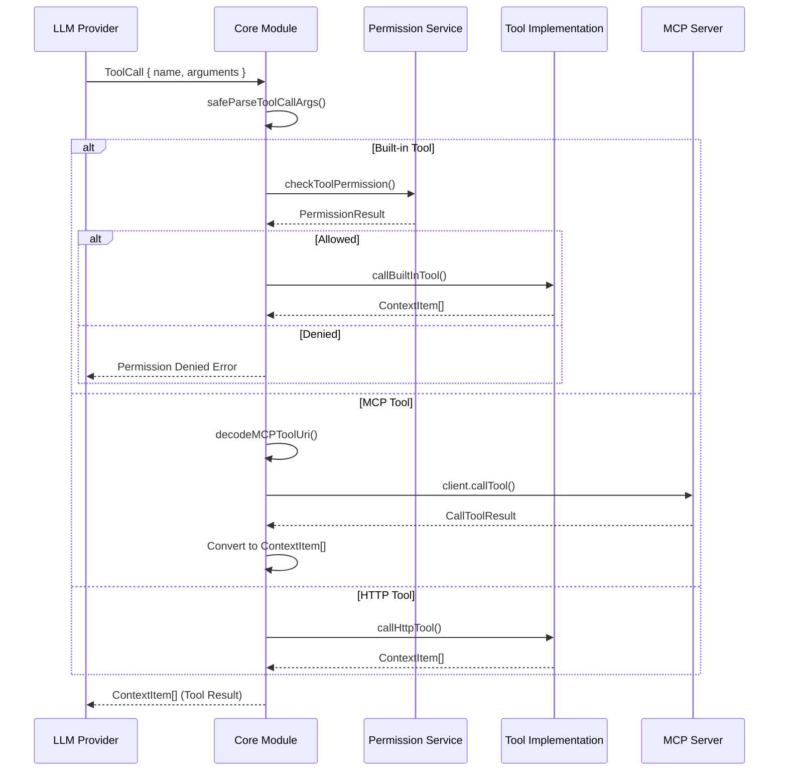

# 도구 시스템 아키텍처

> **목적**: Continue의 Tool Calling 구현, 실행 파이프라인, 권한 관리를 분석하여 hdsp-agent의 도구 시스템 설계에 활용

---

## 1. 개요

Continue는 LLM의 Function Calling 기능을 활용하여 파일 읽기, 터미널 명령 실행, 웹 검색 등 다양한 도구를 지원합니다. 도구는 JSON Schema로 정의되며, MCP 프로토콜을 통해 외부 도구도 통합할 수 있습니다.

### 핵심 파일
- `core/tools/callTool.ts` (7KB) - 도구 실행 파이프라인
- `core/tools/index.ts` - 내장 도구 정의
- `core/tools/implementations/` - 도구 구현체
- `@continuedev/terminal-security` - 권한 관리

---

## 2. 도구 타입 정의

### 2.1 Tool 인터페이스

```typescript
// core/index.d.ts
export type Tool = {
  type: "function";
  function: {
    name: string;
    description: string;
    parameters: JSONSchema;
  };
};

export interface ToolExtras {
  ide: IDE;
  fetch: FetchFunction;
  tool: ToolDefinition;
  config: ContinueConfig;
}

// JSON Schema 형식 파라미터
type JSONSchema = {
  type: "object";
  properties: Record<string, {
    type: string;
    description?: string;
    enum?: string[];
  }>;
  required?: string[];
};
```

### 2.2 ToolCall 타입

```typescript
// core/index.d.ts
export interface ToolCall {
  id: string;
  type: "function";
  function: {
    name: string;
    arguments: string;  // JSON 문자열
  };
}

export interface ToolCallDelta {
  id?: string;
  type?: "function";
  function?: {
    name?: string;
    arguments?: string;  // 스트리밍 중 점진적 누적
  };
}

export type ToolStatus =
  | "generating"   // 인자 스트리밍 중
  | "generated"    // 실행 대기
  | "calling"      // 실행 중
  | "done"         // 완료
  | "errored"      // 에러
  | "canceled";    // 취소됨
```

---

## 3. 내장 도구 정의

### 3.1 도구 목록

```typescript
// core/tools/index.ts
export const BuiltInToolNames = {
  ReadFile: "read_file",
  CreateNewFile: "create_new_file",
  RunTerminalCommand: "run_terminal_command",
  GlobSearch: "glob_search",
  GrepSearch: "grep_search",
  ViewDiff: "view_diff",
  ReadCurrentlyOpenFile: "read_currently_open_file",
  ListDirectory: "ls",
  CreateRuleBlock: "create_rule_block",
  FetchUrlContent: "fetch_url_content",
  SearchWeb: "search_web",
  ViewRepoMap: "view_repo_map",
  ViewSubdirectory: "view_subdirectory",
  Codebase: "codebase",
  ReadFileRange: "read_file_range",
  MultiEdit: "multi_edit",
  EditFile: "edit_file",
  SingleFindAndReplace: "single_find_and_replace",
  RequestRule: "request_rule",
} as const;
```

### 3.2 도구 스키마 예시

```typescript
// core/tools/definitions/readFile.ts
export const readFileTool: Tool = {
  type: "function",
  function: {
    name: "read_file",
    description: "Read the contents of a file at the given path",
    parameters: {
      type: "object",
      properties: {
        filepath: {
          type: "string",
          description: "The path to the file to read, relative to workspace root",
        },
      },
      required: ["filepath"],
    },
  },
};

// core/tools/definitions/runTerminalCommand.ts
export const runTerminalCommandTool: Tool = {
  type: "function",
  function: {
    name: "run_terminal_command",
    description: "Run a command in the terminal and return the output",
    parameters: {
      type: "object",
      properties: {
        command: {
          type: "string",
          description: "The command to run in the terminal",
        },
        workingDirectory: {
          type: "string",
          description: "Optional working directory for the command",
        },
      },
      required: ["command"],
    },
  },
};

// core/tools/definitions/grepSearch.ts
export const grepSearchTool: Tool = {
  type: "function",
  function: {
    name: "grep_search",
    description: "Search for a pattern in files using grep/ripgrep",
    parameters: {
      type: "object",
      properties: {
        pattern: {
          type: "string",
          description: "The regex pattern to search for",
        },
        path: {
          type: "string",
          description: "Directory or file path to search in",
        },
        filePattern: {
          type: "string",
          description: "Glob pattern to filter files (e.g., '*.ts')",
        },
      },
      required: ["pattern"],
    },
  },
};
```

---

## 4. 도구 실행 파이프라인

### 4.1 callTool 함수

```typescript
// core/tools/callTool.ts
export async function callTool(
  toolCall: ToolCall,
  extras: ToolExtras,
): Promise<ContextItem[]> {
  const { function: fn } = toolCall;
  const toolName = fn.name;

  // 1. 인자 파싱
  const args = safeParseToolCallArgs(fn.arguments);

  // 2. 내장 도구 확인
  if (isBuiltInTool(toolName)) {
    return callBuiltInTool(toolName, args, extras);
  }

  // 3. URI 기반 도구 (HTTP, MCP)
  const toolDef = extras.config.tools?.find(t => t.function.name === toolName);
  if (toolDef?.uri) {
    return callToolFromUri(toolDef.uri, args, extras);
  }

  throw new Error(`Unknown tool: ${toolName}`);
}
```

### 4.2 내장 도구 실행

```typescript
// core/tools/callTool.ts
export async function callBuiltInTool(
  functionName: string,
  args: any,
  extras: ToolExtras,
): Promise<ContextItem[]> {
  switch (functionName) {
    case BuiltInToolNames.ReadFile:
      return readFileImpl(args, extras);

    case BuiltInToolNames.CreateNewFile:
      return createNewFileImpl(args, extras);

    case BuiltInToolNames.RunTerminalCommand:
      return runTerminalCommandImpl(args, extras);

    case BuiltInToolNames.GlobSearch:
      return fileGlobSearchImpl(args, extras);

    case BuiltInToolNames.GrepSearch:
      return grepSearchImpl(args, extras);

    case BuiltInToolNames.ViewDiff:
      return viewDiffImpl(args, extras);

    case BuiltInToolNames.ListDirectory:
      return lsToolImpl(args, extras);

    case BuiltInToolNames.SearchWeb:
      return searchWebImpl(args, extras);

    default:
      throw new Error(`Unknown built-in tool: ${functionName}`);
  }
}
```

### 4.3 도구 구현 예시

```typescript
// core/tools/implementations/readFile.ts
export async function readFileImpl(
  args: { filepath: string },
  extras: ToolExtras,
): Promise<ContextItem[]> {
  const { filepath } = args;
  const { ide } = extras;

  // 절대 경로 변환
  const absolutePath = path.isAbsolute(filepath)
    ? filepath
    : path.join(ide.getWorkspaceDirs()[0], filepath);

  // 파일 읽기
  const content = await ide.readFile(absolutePath);

  return [{
    name: path.basename(filepath),
    description: `Contents of ${filepath}`,
    content,
  }];
}

// core/tools/implementations/runTerminalCommand.ts
export async function runTerminalCommandImpl(
  args: { command: string; workingDirectory?: string },
  extras: ToolExtras,
): Promise<ContextItem[]> {
  const { command, workingDirectory } = args;
  const { ide } = extras;

  // 터미널 명령 실행
  const output = await ide.runCommand(command, {
    cwd: workingDirectory,
  });

  return [{
    name: "Terminal Output",
    description: `Output of: ${command}`,
    content: output,
  }];
}

// core/tools/implementations/grepSearch.ts
export async function grepSearchImpl(
  args: { pattern: string; path?: string; filePattern?: string },
  extras: ToolExtras,
): Promise<ContextItem[]> {
  const { pattern, path: searchPath, filePattern } = args;
  const { ide } = extras;

  const results = await ide.grepSearch(pattern, {
    path: searchPath,
    include: filePattern,
  });

  return [{
    name: "Search Results",
    description: `Grep results for: ${pattern}`,
    content: results.map(r => `${r.filepath}:${r.line}: ${r.content}`).join("\n"),
  }];
}
```

---

## 5. URI 기반 도구

### 5.1 HTTP 도구

```typescript
// core/tools/callTool.ts
async function callHttpTool(
  url: string,
  args: any,
  extras: ToolExtras,
): Promise<ContextItem[]> {
  const response = await extras.fetch(url, {
    method: "POST",
    headers: {
      "Content-Type": "application/json",
    },
    body: JSON.stringify({
      arguments: args,
    }),
  });

  const data = await response.json();

  if (!response.ok) {
    throw new Error(`Failed to call tool at ${url}:\n${JSON.stringify(data)}`);
  }

  return data.output;
}
```

### 5.2 MCP 도구

```typescript
// core/tools/callTool.ts
export function encodeMCPToolUri(mcpId: string, toolName: string): string {
  return `mcp://${encodeURIComponent(mcpId)}/${encodeURIComponent(toolName)}`;
}

export function decodeMCPToolUri(uri: string): [string, string] | null {
  const url = new URL(uri);
  if (url.protocol !== "mcp:") {
    return null;
  }
  return [
    decodeURIComponent(url.hostname),
    decodeURIComponent(url.pathname).slice(1),
  ];
}

async function callToolFromUri(
  uri: string,
  args: any,
  extras: ToolExtras,
): Promise<ContextItem[]> {
  const parsedUri = new URL(uri);

  switch (parsedUri.protocol) {
    case "http:":
    case "https:":
      return callHttpTool(uri, args, extras);

    case "mcp:":
      const decoded = decodeMCPToolUri(uri);
      if (!decoded) {
        throw new Error(`Invalid MCP tool URI: ${uri}`);
      }

      const [mcpId, toolName] = decoded;
      const client = MCPManagerSingleton.getInstance().getConnection(mcpId);

      if (!client) {
        throw new Error("MCP connection not found");
      }

      // MCP 도구 호출
      const response = await client.client.callTool(
        { name: toolName, arguments: args },
        CallToolResultSchema,
        { timeout: client.options.timeout },
      );

      if (response.isError === true) {
        throw new Error(JSON.stringify(response.content));
      }

      // 결과 변환
      return response.content.map((item: any) => ({
        name: extras.tool.displayTitle,
        description: "Tool output",
        content: item.type === "text" ? item.text : item.resource?.text,
        icon: extras.tool.faviconUrl,
      }));

    default:
      throw new Error(`Unsupported protocol: ${parsedUri.protocol}`);
  }
}
```

---

## 6. 권한 관리

### 6.1 ToolPolicy 타입

```typescript
// @continuedev/terminal-security
export interface ToolPolicy {
  toolName: string;
  allowed: boolean;
  autoApprove?: boolean;
  requireConfirmation?: boolean;
  maxExecutions?: number;
  timeout?: number;
}

export type ToolPolicyEvaluator = (
  basePolicy: ToolPolicy,
  parsedArgs: any,
) => ToolPolicy;
```

### 6.2 CLI 권한 시스템

```typescript
// extensions/cli/src/tools/types.ts
interface Tool {
  name: string;
  displayName: string;
  description: string;
  parameters: ToolParametersSchema;

  // 전처리 (미리보기, 권한 확인)
  preprocess?: (args: any) => Promise<PreprocessToolCallResult>;

  // 실행
  run: (args: any) => Promise<string>;

  // 읽기 전용 여부 (권한 결정에 사용)
  readonly?: boolean;

  // 내장 도구 여부
  isBuiltIn: boolean;

  // 정책 평가자
  evaluateToolCallPolicy?: ToolPolicyEvaluator;
}

interface PreprocessToolCallResult {
  preview?: string;           // 사용자에게 보여줄 미리보기
  requiresConfirmation: boolean;
  confirmationMessage?: string;
}
```

### 6.3 권한 확인 플로우

```typescript
// extensions/cli/src/permissions/checkToolPermission.ts
export async function checkToolPermission(
  tool: Tool,
  args: any,
  permissionService: ToolPermissionService,
): Promise<PermissionResult> {
  // 1. 기본 정책 가져오기
  let policy = permissionService.getPolicyForTool(tool.name);

  // 2. 도구별 정책 평가
  if (tool.evaluateToolCallPolicy) {
    policy = tool.evaluateToolCallPolicy(policy, args);
  }

  // 3. 자동 승인 확인
  if (policy.autoApprove) {
    return { allowed: true };
  }

  // 4. 읽기 전용 도구는 승인
  if (tool.readonly) {
    return { allowed: true };
  }

  // 5. 사용자 확인 요청
  if (policy.requireConfirmation) {
    const confirmed = await permissionService.requestConfirmation(
      tool.displayName,
      args,
    );
    return { allowed: confirmed };
  }

  return { allowed: policy.allowed };
}
```

---

## 7. 도구 호출 플로우



---

## 8. 인자 파싱

### 8.1 안전한 파싱

```typescript
// core/tools/parseArgs.ts
export function safeParseToolCallArgs(
  argumentsStr: string,
): Record<string, any> {
  try {
    // JSON 파싱 시도
    return JSON.parse(argumentsStr);
  } catch (error) {
    // 스트리밍 중 불완전한 JSON
    if (argumentsStr.trim() === "") {
      return {};
    }

    // 복구 시도: 닫히지 않은 문자열/객체 처리
    try {
      const fixed = fixIncompleteJson(argumentsStr);
      return JSON.parse(fixed);
    } catch {
      throw new ContinueError(
        `Failed to parse tool arguments: ${argumentsStr}`,
        ContinueErrorReason.INVALID_REQUEST,
      );
    }
  }
}

function fixIncompleteJson(json: string): string {
  // 닫히지 않은 문자열
  const quoteCount = (json.match(/"/g) || []).length;
  if (quoteCount % 2 !== 0) {
    json += '"';
  }

  // 닫히지 않은 객체
  const openBraces = (json.match(/{/g) || []).length;
  const closeBraces = (json.match(/}/g) || []).length;
  json += "}".repeat(openBraces - closeBraces);

  return json;
}
```

---

## 9. hdsp-agent 적용 방안

### 9.1 도구 정의

```python
# hdsp-agent/tools/base.py
from abc import ABC, abstractmethod
from dataclasses import dataclass
from typing import Any

@dataclass
class ToolDefinition:
    name: str
    description: str
    parameters: dict  # JSON Schema

@dataclass
class ContextItem:
    name: str
    description: str
    content: str
    icon: str | None = None

class BaseTool(ABC):
    @property
    @abstractmethod
    def definition(self) -> ToolDefinition:
        pass

    @abstractmethod
    async def execute(self, args: dict) -> list[ContextItem]:
        pass

    @property
    def readonly(self) -> bool:
        return False
```

### 9.2 도구 구현 예시

```python
# hdsp-agent/tools/implementations/file_tools.py
import os

class ReadFileTool(BaseTool):
    @property
    def definition(self) -> ToolDefinition:
        return ToolDefinition(
            name="read_file",
            description="Read the contents of a file",
            parameters={
                "type": "object",
                "properties": {
                    "filepath": {
                        "type": "string",
                        "description": "Path to the file",
                    },
                },
                "required": ["filepath"],
            },
        )

    @property
    def readonly(self) -> bool:
        return True

    async def execute(self, args: dict) -> list[ContextItem]:
        filepath = args["filepath"]

        with open(filepath, "r") as f:
            content = f.read()

        return [ContextItem(
            name=os.path.basename(filepath),
            description=f"Contents of {filepath}",
            content=content,
        )]


class RunCellTool(BaseTool):
    """Jupyter 특화 도구: 셀 실행"""

    @property
    def definition(self) -> ToolDefinition:
        return ToolDefinition(
            name="run_cell",
            description="Execute Python code in a Jupyter cell",
            parameters={
                "type": "object",
                "properties": {
                    "code": {
                        "type": "string",
                        "description": "Python code to execute",
                    },
                },
                "required": ["code"],
            },
        )

    async def execute(self, args: dict) -> list[ContextItem]:
        from IPython import get_ipython

        ipython = get_ipython()
        result = ipython.run_cell(args["code"])

        return [ContextItem(
            name="Cell Output",
            description="Execution result",
            content=str(result.result) if result.success else str(result.error_in_exec),
        )]
```

### 9.3 도구 레지스트리

```python
# hdsp-agent/tools/registry.py
from typing import Type

class ToolRegistry:
    def __init__(self):
        self._tools: dict[str, BaseTool] = {}

    def register(self, tool: BaseTool) -> None:
        self._tools[tool.definition.name] = tool

    def get(self, name: str) -> BaseTool | None:
        return self._tools.get(name)

    def get_all_definitions(self) -> list[dict]:
        """LLM에 전달할 도구 스키마 목록"""
        return [
            {
                "type": "function",
                "function": {
                    "name": tool.definition.name,
                    "description": tool.definition.description,
                    "parameters": tool.definition.parameters,
                },
            }
            for tool in self._tools.values()
        ]

# 기본 레지스트리
default_registry = ToolRegistry()
default_registry.register(ReadFileTool())
default_registry.register(RunCellTool())
```

### 9.4 도구 실행 파이프라인

```python
# hdsp-agent/tools/executor.py
import json

class ToolExecutor:
    def __init__(self, registry: ToolRegistry):
        self.registry = registry

    async def execute(
        self,
        tool_call: dict,
        permission_service: PermissionService | None = None,
    ) -> list[ContextItem]:
        name = tool_call["function"]["name"]
        args_str = tool_call["function"]["arguments"]

        # 1. 인자 파싱
        args = self._safe_parse_args(args_str)

        # 2. 도구 찾기
        tool = self.registry.get(name)
        if not tool:
            raise ValueError(f"Unknown tool: {name}")

        # 3. 권한 확인
        if permission_service and not tool.readonly:
            allowed = await permission_service.check_permission(name, args)
            if not allowed:
                raise PermissionError(f"Permission denied for tool: {name}")

        # 4. 실행
        return await tool.execute(args)

    def _safe_parse_args(self, args_str: str) -> dict:
        try:
            return json.loads(args_str)
        except json.JSONDecodeError:
            if not args_str.strip():
                return {}
            raise
```

### 9.5 구현 체크리스트

- [ ] `BaseTool` 추상 클래스 정의
- [ ] `ToolDefinition` 데이터 클래스
- [ ] `ToolRegistry` 레지스트리 구현
- [ ] `ToolExecutor` 실행 파이프라인
- [ ] 기본 도구 구현 (read_file, run_cell, search)
- [ ] 권한 관리 시스템
- [ ] MCP 도구 통합
- [ ] 인자 파싱 에러 처리

---

## 10. 참고 파일

| 파일 | 크기 | 용도 |
|------|------|------|
| `core/tools/callTool.ts` | 7KB | 도구 실행 파이프라인 |
| `core/tools/index.ts` | - | 도구 정의 및 등록 |
| `core/tools/implementations/` | - | 내장 도구 구현 |
| `core/tools/parseArgs.ts` | - | 인자 파싱 |
| `@continuedev/terminal-security` | - | 권한 관리 패키지 |

---

*이전 문서: [03-프로토콜-통신.md](./03-프로토콜-통신.md)*
*다음 문서: [05-컨텍스트-제공자.md](./05-컨텍스트-제공자.md)*
