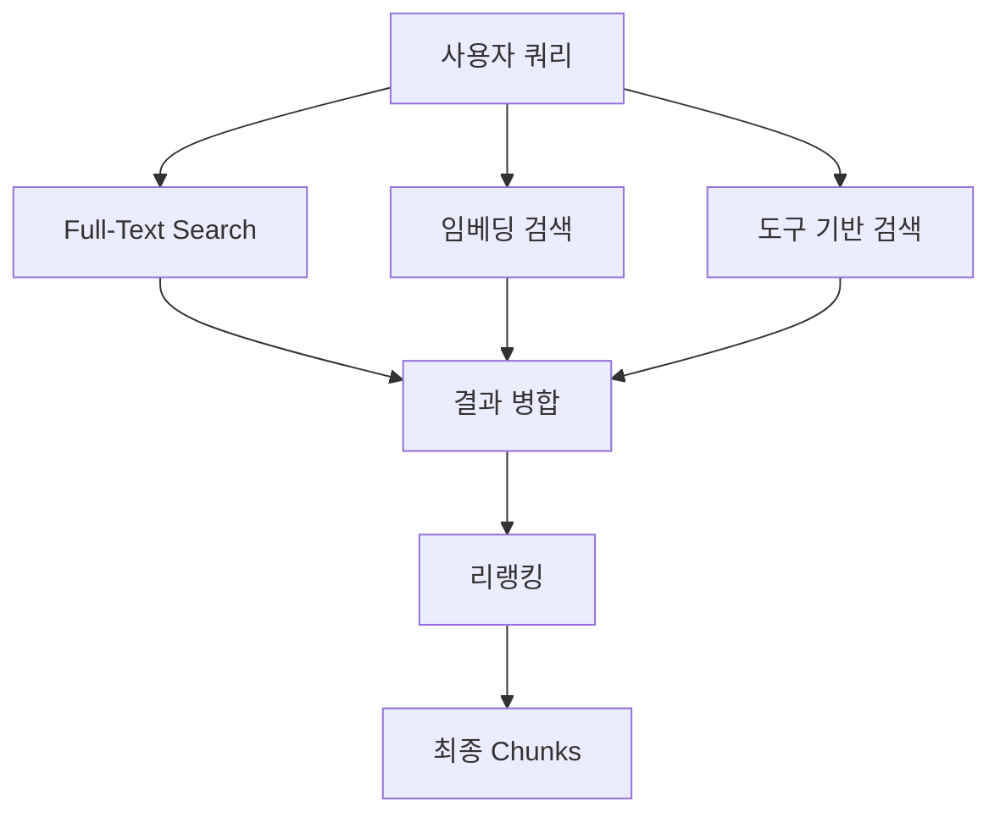
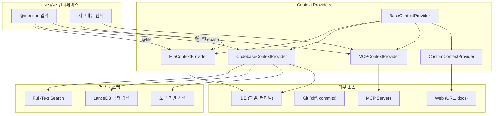

# 컨텍스트 제공자 시스템

> **목적**: LLM에 제공되는 컨텍스트를 수집하고 관리하는 Context Provider 아키텍처 분석

---

## 1. 개요

Continue의 컨텍스트 시스템은 LLM 대화에 필요한 외부 정보를 수집하는 확장 가능한 프레임워크입니다. 30개 이상의 내장 제공자와 MCP 통합을 통해 파일, 코드베이스, 문서, 외부 서비스 등 다양한 소스에서 컨텍스트를 가져옵니다.

### 핵심 특징
- **플러그인 아키텍처**: `BaseContextProvider` 상속으로 손쉬운 확장
- **동적 메뉴 지원**: 서브메뉴를 통한 항목 선택
- **임베딩 기반 검색**: LanceDB와 Full-Text Search 결합
- **MCP 통합**: 외부 리소스 프로바이더 연결

---

## 2. 핵심 인터페이스

### 2.1 IContextProvider 인터페이스

```typescript
// core/index.d.ts
export interface IContextProvider {
  get description(): ContextProviderDescription;

  getContextItems(
    query: string,
    extras: ContextProviderExtras,
  ): Promise<ContextItem[]>;

  loadSubmenuItems(args: LoadSubmenuItemsArgs): Promise<ContextSubmenuItem[]>;
}

export interface ContextProviderDescription {
  title: ContextProviderName;
  displayTitle: string;
  description: string;
  type: "normal" | "query" | "submenu";
  dependsOnIndexing?: boolean;
  renderInlineAs?: string;
}
```

### 2.2 BaseContextProvider 추상 클래스

```typescript
// core/context/index.ts
export abstract class BaseContextProvider implements IContextProvider {
  options: { [key: string]: any };

  constructor(options: { [key: string]: any }) {
    this.options = options;
  }

  static description: ContextProviderDescription;

  get description(): ContextProviderDescription {
    return (this.constructor as any).description;
  }

  // 필수 구현: 컨텍스트 아이템 반환
  abstract getContextItems(
    query: string,
    extras: ContextProviderExtras,
  ): Promise<ContextItem[]>;

  // 선택적: 서브메뉴 아이템 로드
  async loadSubmenuItems(
    args: LoadSubmenuItemsArgs,
  ): Promise<ContextSubmenuItem[]> {
    return [];
  }
}
```

### 2.3 ContextItem 구조

```typescript
export interface ContextItem {
  name: string;           // 표시 이름
  description: string;    // 상세 설명
  content: string;        // 실제 컨텍스트 내용
  uri?: {                 // 소스 식별자
    type: "file" | "url" | "other";
    value: string;
  };
  editing?: boolean;      // 편집 모드 여부
  editable?: boolean;     // 편집 가능 여부
}
```

---

## 3. 내장 컨텍스트 제공자

### 3.1 제공자 레지스트리

```typescript
// core/context/providers/index.ts
export const Providers: (typeof BaseContextProvider)[] = [
  FileContextProvider,        // @file - 파일 내용
  DiffContextProvider,        // @diff - Git diff
  FileTreeContextProvider,    // @tree - 디렉토리 구조
  GitHubIssuesContextProvider,// @github - GitHub 이슈
  TerminalContextProvider,    // @terminal - 터미널 출력
  OpenFilesContextProvider,   // @open - 열린 파일들
  SearchContextProvider,      // @search - 코드 검색
  DocsContextProvider,        // @docs - 문서 검색
  CodebaseContextProvider,    // @codebase - 코드베이스 검색
  CurrentFileContextProvider, // @currentFile - 현재 파일
  URLContextProvider,         // @url - 웹 페이지
  MCPContextProvider,         // @mcp - MCP 리소스
  ClipboardContextProvider,   // @clipboard - 클립보드
  RulesContextProvider,       // @rules - 규칙 파일
  // ... 30+ 제공자
];

export function contextProviderClassFromName(
  name: ContextProviderName,
): typeof BaseContextProvider | undefined {
  return Providers.find((cls) => cls.description.title === name);
}
```

### 3.2 제공자 타입별 분류

| 타입 | 설명 | 예시 |
|------|------|------|
| `normal` | 즉시 실행 | `@currentFile`, `@clipboard` |
| `query` | 쿼리 입력 필요 | `@search`, `@codebase` |
| `submenu` | 항목 선택 메뉴 | `@file`, `@docs` |

### 3.3 FileContextProvider 구현 예시

```typescript
// core/context/providers/FileContextProvider.ts
class FileContextProvider extends BaseContextProvider {
  static description: ContextProviderDescription = {
    title: "file",
    displayTitle: "Files",
    description: "Type to search",
    type: "submenu",
  };

  async getContextItems(
    query: string,
    extras: ContextProviderExtras,
  ): Promise<ContextItem[]> {
    // query는 파일 경로
    const fileUri = query.trim();
    const content = await extras.ide.readFile(fileUri);

    const { relativePathOrBasename, last2Parts, baseName } = getUriDescription(
      fileUri,
      await extras.ide.getWorkspaceDirs(),
    );

    return [
      {
        name: baseName,
        description: last2Parts,
        content: `\`\`\`${relativePathOrBasename}\n${content}\n\`\`\``,
        uri: {
          type: "file",
          value: fileUri,
        },
      },
    ];
  }

  async loadSubmenuItems(
    args: LoadSubmenuItemsArgs,
  ): Promise<ContextSubmenuItem[]> {
    const workspaceDirs = await args.ide.getWorkspaceDirs();
    const results = await walkDirs(args.ide, { source: "file" }, workspaceDirs);
    const files = results.flat().slice(-10_000);

    return files.map((file) => ({
      id: file.uri,
      title: getUriPathBasename(file.uri),
      description: file.uniquePath,
    }));
  }
}
```

---

## 4. 검색 파이프라인

### 4.1 BaseRetrievalPipeline 구조

```typescript
// core/context/retrieval/pipelines/BaseRetrievalPipeline.ts
export interface RetrievalPipelineOptions {
  llm: ILLM;
  config: ContinueConfig;
  ide: IDE;
  input: string;
  nRetrieve: number;    // 검색 개수
  nFinal: number;       // 최종 반환 개수
  tags: BranchAndDir[];
  filterDirectory?: string;
}

export interface IRetrievalPipeline {
  run(args: RetrievalPipelineRunArguments): Promise<Chunk[]>;
}

export default class BaseRetrievalPipeline implements IRetrievalPipeline {
  private ftsIndex = new FullTextSearchCodebaseIndex();
  private lanceDbIndex: LanceDbIndex | null = null;

  constructor(protected readonly options: RetrievalPipelineOptions) {
    void this.initLanceDb();
  }

  // LanceDB 벡터 검색 초기화
  protected async initLanceDb() {
    const embedModel = this.options.config.selectedModelByRole.embed;
    if (!embedModel) return;

    this.lanceDbIndex = await LanceDbIndex.create(embedModel, (uri) =>
      this.options.ide.readFile(uri),
    );
  }

  // Full-Text Search
  protected async retrieveFts(
    args: RetrievalPipelineRunArguments,
    n: number,
  ): Promise<Chunk[]> {
    const tokens = this.getCleanedTrigrams(args.query).join(" OR ");
    return await this.ftsIndex.retrieve({
      n,
      text: tokens,
      tags: args.tags,
      directory: args.filterDirectory,
    });
  }

  // 임베딩 기반 검색
  protected async retrieveEmbeddings(
    input: string,
    n: number,
  ): Promise<Chunk[]> {
    const initialized = await this.ensureLanceDbInitialized();
    if (!initialized || !this.lanceDbIndex) return [];

    return this.lanceDbIndex.retrieve(
      input,
      n,
      this.options.tags,
      this.options.filterDirectory,
    );
  }
}
```

### 4.2 하이브리드 검색 전략



### 4.3 도구 기반 검색

```typescript
// 도구를 활용한 동적 검색
protected async retrieveWithTools(input: string): Promise<Chunk[]> {
  const AVAILABLE_TOOLS: Tool[] = [
    globSearchTool,
    grepSearchTool,
    lsTool,
    readFileTool,
    viewRepoMapTool,
    viewSubdirectoryTool,
  ];

  // LLM에게 도구 선택 위임
  const toolSelectionPrompt = `Given: "${input}"
Available tools: ${AVAILABLE_TOOLS.map(t => t.function.name)}
Respond with JSON: { "tools": [{ "name": "...", "args": {...} }] }`;

  const toolSelectionResponse = await this.options.llm.chat(
    [{ role: "user", content: toolSelectionPrompt }],
    new AbortController().signal,
  );

  // 선택된 도구 실행
  const toolCalls = JSON.parse(toolSelectionResponse.content).tools;
  const allContextItems: ContextItem[] = [];

  for (const toolCall of toolCalls) {
    const contextItems = await callBuiltInTool(
      toolCall.name,
      toolCall.args,
      toolExtras,
    );
    allContextItems.push(...contextItems);
  }

  // ContextItem → Chunk 변환
  return allContextItems.map((item, i) => ({
    content: item.content,
    filepath: item.uri?.value || item.name,
    startLine: -1,
    endLine: -1,
    index: i,
  }));
}
```

---

## 5. MCP 리소스 통합

### 5.1 MCPContextProvider

```typescript
// core/context/providers/MCPContextProvider.ts
class MCPContextProvider extends BaseContextProvider {
  static description: ContextProviderDescription = {
    title: "mcp",
    displayTitle: "MCP Resources",
    description: "Resources from MCP servers",
    type: "submenu",
  };

  async getContextItems(
    query: string,  // "mcp://server-id/resource-uri" 형식
    extras: ContextProviderExtras,
  ): Promise<ContextItem[]> {
    const [serverId, resourceUri] = decodeMCPResourceUri(query);
    const manager = MCPManagerSingleton.getInstance();
    const connection = manager.getConnection(serverId);

    const resource = await connection.client.readResource({
      uri: resourceUri,
    });

    return resource.contents.map(content => ({
      name: content.uri,
      description: `MCP Resource from ${serverId}`,
      content: content.text || JSON.stringify(content.blob),
      uri: { type: "other", value: query },
    }));
  }

  async loadSubmenuItems(
    args: LoadSubmenuItemsArgs,
  ): Promise<ContextSubmenuItem[]> {
    const manager = MCPManagerSingleton.getInstance();
    const allResources: ContextSubmenuItem[] = [];

    for (const [serverId, connection] of manager.connections) {
      for (const resource of connection.resources) {
        allResources.push({
          id: encodeMCPResourceUri(serverId, resource.uri),
          title: resource.name,
          description: `${serverId}: ${resource.description}`,
        });
      }
    }

    return allResources;
  }
}
```

### 5.2 MCP 리소스 URI 인코딩

```typescript
// URI 형식: mcp://[server-id]/[resource-uri]
export function encodeMCPResourceUri(
  serverId: string,
  resourceUri: string
): string {
  return `mcp://${encodeURIComponent(serverId)}/${encodeURIComponent(resourceUri)}`;
}

export function decodeMCPResourceUri(uri: string): [string, string] {
  const url = new URL(uri);
  const serverId = decodeURIComponent(url.host);
  const resourceUri = decodeURIComponent(url.pathname.slice(1));
  return [serverId, resourceUri];
}
```

---

## 6. 임베딩 시스템

### 6.1 LanceDbIndex 구조

```typescript
// core/indexing/LanceDbIndex.ts
export class LanceDbIndex {
  private db: LanceDB;
  private table: Table<EmbeddingRecord>;
  private embedModel: EmbeddingsProvider;

  static async create(
    embedModel: EmbeddingsProvider,
    readFile: (uri: string) => Promise<string>,
  ): Promise<LanceDbIndex> {
    const db = await lancedb.connect("~/.continue/embeddings");
    return new LanceDbIndex(db, embedModel, readFile);
  }

  async retrieve(
    query: string,
    n: number,
    tags: BranchAndDir[],
    filterDirectory?: string,
  ): Promise<Chunk[]> {
    // 쿼리 임베딩 생성
    const queryEmbedding = await this.embedModel.embed([query]);

    // 벡터 유사도 검색
    const results = await this.table
      .vectorSearch(queryEmbedding[0])
      .limit(n)
      .execute();

    return results.map(this.recordToChunk);
  }

  async addChunks(chunks: Chunk[]): Promise<void> {
    const embeddings = await this.embedModel.embed(
      chunks.map(c => c.content)
    );

    const records = chunks.map((chunk, i) => ({
      ...chunk,
      vector: embeddings[i],
    }));

    await this.table.add(records);
  }
}
```

### 6.2 문서 청킹 전략

```typescript
// core/indexing/chunk/chunk.ts
export async function* chunkDocument(options: {
  filepath: string;
  contents: string;
  maxChunkSize: number;
  digest: string;
}): AsyncGenerator<Chunk> {
  const { filepath, contents, maxChunkSize } = options;

  // 언어별 파서 선택
  const parser = getParserForExtension(getExtension(filepath));

  if (parser) {
    // AST 기반 시맨틱 청킹
    for await (const chunk of chunkByAst(parser, contents, maxChunkSize)) {
      yield chunk;
    }
  } else {
    // 라인 기반 기본 청킹
    for await (const chunk of chunkByLines(contents, maxChunkSize)) {
      yield chunk;
    }
  }
}
```

---

## 7. 아키텍처 다이어그램



---

## 8. hdsp-agent 적용 방안

### 8.1 Python Context Provider 구현

```python
from abc import ABC, abstractmethod
from typing import List, Dict, Any, Optional
from dataclasses import dataclass

@dataclass
class ContextItem:
    name: str
    description: str
    content: str
    uri_type: str = "other"
    uri_value: str = ""

@dataclass
class ContextProviderDescription:
    title: str
    display_title: str
    description: str
    provider_type: str  # "normal" | "query" | "submenu"
    depends_on_indexing: bool = False

class BaseContextProvider(ABC):
    """컨텍스트 제공자 기본 클래스"""

    description: ContextProviderDescription

    def __init__(self, options: Dict[str, Any] = None):
        self.options = options or {}

    @abstractmethod
    async def get_context_items(
        self,
        query: str,
        extras: "ContextProviderExtras"
    ) -> List[ContextItem]:
        """컨텍스트 아이템 반환 (필수 구현)"""
        pass

    async def load_submenu_items(
        self,
        args: "LoadSubmenuItemsArgs"
    ) -> List[Dict[str, str]]:
        """서브메뉴 아이템 로드 (선택적)"""
        return []


class NotebookContextProvider(BaseContextProvider):
    """현재 노트북 컨텍스트 제공자"""

    description = ContextProviderDescription(
        title="notebook",
        display_title="Current Notebook",
        description="Current Jupyter notebook content",
        provider_type="normal"
    )

    async def get_context_items(
        self,
        query: str,
        extras: "ContextProviderExtras"
    ) -> List[ContextItem]:
        notebook = extras.kernel.get_current_notebook()
        cells_content = []

        for i, cell in enumerate(notebook.cells):
            cell_type = cell.cell_type
            source = cell.source
            cells_content.append(f"# Cell {i+1} ({cell_type})\n{source}")

        return [
            ContextItem(
                name=notebook.name,
                description=f"Notebook with {len(notebook.cells)} cells",
                content="\n\n".join(cells_content),
                uri_type="file",
                uri_value=notebook.path
            )
        ]


class VariableContextProvider(BaseContextProvider):
    """커널 변수 컨텍스트 제공자"""

    description = ContextProviderDescription(
        title="variable",
        display_title="Variables",
        description="Select kernel variables",
        provider_type="submenu"
    )

    async def get_context_items(
        self,
        query: str,  # 변수명
        extras: "ContextProviderExtras"
    ) -> List[ContextItem]:
        var_name = query.strip()
        var_info = extras.kernel.get_variable_info(var_name)

        return [
            ContextItem(
                name=var_name,
                description=f"Type: {var_info['type']}",
                content=f"```python\n{var_name} = {var_info['repr']}\n```",
            )
        ]

    async def load_submenu_items(
        self,
        args: "LoadSubmenuItemsArgs"
    ) -> List[Dict[str, str]]:
        variables = args.kernel.list_variables()
        return [
            {
                "id": var["name"],
                "title": var["name"],
                "description": f"{var['type']} - {var['size']}"
            }
            for var in variables
        ]
```

### 8.2 검색 파이프라인 구현

```python
from typing import List, Optional
import numpy as np
from dataclasses import dataclass

@dataclass
class Chunk:
    content: str
    filepath: str
    start_line: int
    end_line: int
    score: float = 0.0

class RetrievalPipeline:
    """하이브리드 검색 파이프라인"""

    def __init__(
        self,
        embeddings_provider: "EmbeddingsProvider",
        fts_index: "FullTextSearchIndex",
        n_retrieve: int = 50,
        n_final: int = 10
    ):
        self.embeddings = embeddings_provider
        self.fts = fts_index
        self.n_retrieve = n_retrieve
        self.n_final = n_final

    async def run(self, query: str) -> List[Chunk]:
        # 1. Full-Text Search
        fts_results = await self.fts.search(query, n=self.n_retrieve)

        # 2. Semantic Search
        query_embedding = await self.embeddings.embed([query])
        semantic_results = await self.vector_search(
            query_embedding[0],
            n=self.n_retrieve
        )

        # 3. 결과 병합 및 중복 제거
        merged = self._merge_results(fts_results, semantic_results)

        # 4. 리랭킹 (선택적)
        if self.reranker:
            merged = await self._rerank(query, merged)

        return merged[:self.n_final]

    def _merge_results(
        self,
        fts: List[Chunk],
        semantic: List[Chunk]
    ) -> List[Chunk]:
        """RRF (Reciprocal Rank Fusion) 알고리즘"""
        scores = {}
        k = 60  # RRF 상수

        for rank, chunk in enumerate(fts):
            key = (chunk.filepath, chunk.start_line)
            scores[key] = scores.get(key, 0) + 1 / (k + rank + 1)

        for rank, chunk in enumerate(semantic):
            key = (chunk.filepath, chunk.start_line)
            scores[key] = scores.get(key, 0) + 1 / (k + rank + 1)

        # 점수로 정렬
        all_chunks = {(c.filepath, c.start_line): c for c in fts + semantic}
        sorted_keys = sorted(scores.keys(), key=lambda k: scores[k], reverse=True)

        return [all_chunks[k] for k in sorted_keys if k in all_chunks]
```

### 8.3 MCP 리소스 통합

```python
class MCPContextProvider(BaseContextProvider):
    """MCP 서버 리소스 제공자"""

    description = ContextProviderDescription(
        title="mcp",
        display_title="MCP Resources",
        description="Resources from MCP servers",
        provider_type="submenu"
    )

    def __init__(self, mcp_manager: "MCPManager"):
        super().__init__()
        self.mcp_manager = mcp_manager

    async def get_context_items(
        self,
        query: str,  # "mcp://server-id/resource-uri"
        extras: "ContextProviderExtras"
    ) -> List[ContextItem]:
        server_id, resource_uri = self._decode_uri(query)
        connection = self.mcp_manager.get_connection(server_id)

        resource = await connection.read_resource(resource_uri)

        return [
            ContextItem(
                name=resource.name,
                description=f"MCP: {server_id}",
                content=resource.text or str(resource.blob),
                uri_type="other",
                uri_value=query
            )
        ]

    async def load_submenu_items(
        self,
        args: "LoadSubmenuItemsArgs"
    ) -> List[Dict[str, str]]:
        items = []

        for server_id, connection in self.mcp_manager.connections.items():
            for resource in connection.resources:
                items.append({
                    "id": self._encode_uri(server_id, resource.uri),
                    "title": resource.name,
                    "description": f"{server_id}: {resource.description}"
                })

        return items

    def _encode_uri(self, server_id: str, resource_uri: str) -> str:
        return f"mcp://{quote(server_id)}/{quote(resource_uri)}"

    def _decode_uri(self, uri: str) -> tuple:
        parsed = urlparse(uri)
        return unquote(parsed.netloc), unquote(parsed.path[1:])
```

---

## 9. 주요 패턴 요약

### 9.1 Provider Pattern 장점
- **확장성**: 새 컨텍스트 소스 쉽게 추가
- **일관성**: 동일한 인터페이스로 다양한 소스 처리
- **분리**: 각 제공자가 독립적으로 동작

### 9.2 하이브리드 검색 전략
- **FTS**: 정확한 키워드 매칭
- **Semantic**: 의미적 유사성 파악
- **Tools**: LLM 기반 동적 검색

### 9.3 성능 최적화
- **청킹**: 큰 문서를 적절한 크기로 분할
- **캐싱**: 임베딩 결과 재사용
- **배치 처리**: 여러 쿼리 동시 처리

---

## 10. 참고 파일

| 파일 | 용도 |
|------|------|
| `core/context/index.ts` | BaseContextProvider 정의 |
| `core/context/providers/index.ts` | 제공자 레지스트리 |
| `core/context/providers/FileContextProvider.ts` | 파일 제공자 예시 |
| `core/context/providers/MCPContextProvider.ts` | MCP 통합 |
| `core/context/retrieval/pipelines/BaseRetrievalPipeline.ts` | 검색 파이프라인 |
| `core/indexing/LanceDbIndex.ts` | 벡터 검색 인덱스 |

---

*다음 문서: [06-에이전트-모드.md](./06-에이전트-모드.md)*
