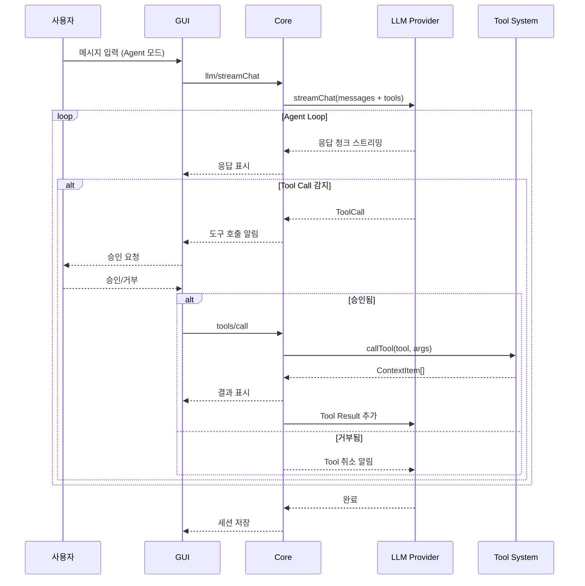
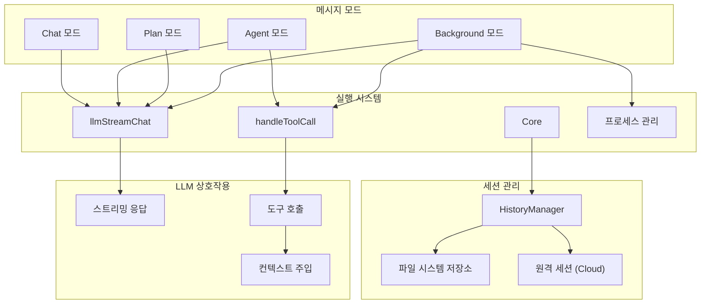

# 에이전트 모드 시스템

> **목적**: Continue의 4가지 메시지 모드(Chat, Agent, Plan, Background)와 에이전트 실행 루프 분석

---

## 1. 개요

Continue는 사용자 요청 유형에 따라 4가지 메시지 모드를 지원합니다. 각 모드는 LLM과의 상호작용 방식, 도구 사용 가능 여부, 실행 컨텍스트가 다릅니다.

### 메시지 모드 정의

```typescript
// core/index.d.ts
export type MessageModes = "chat" | "agent" | "plan" | "background";
```

| 모드 | 설명 | 도구 사용 | 자동 실행 |
|------|------|----------|----------|
| `chat` | 일반 대화, 질문 응답 | ❌ | - |
| `agent` | 자율적 코드 수정, 명령 실행 | ✅ | 승인 필요 |
| `plan` | 작업 계획 수립 | 제한적 | - |
| `background` | 백그라운드 에이전트 실행 | ✅ | 자동 |

---

## 2. 세션 및 히스토리 구조

### 2.1 Session 인터페이스

```typescript
// core/index.d.ts
export interface Session {
  sessionId: string;
  title: string;
  workspaceDirectory: string;
  history: ChatHistoryItem[];
  mode?: MessageModes;  // 세션별 UI 모드
  usage?: SessionUsage;
}

export interface SessionUsage extends Usage {
  totalCost: number;  // 총 API 비용 (USD)
}
```

### 2.2 ChatHistoryItem 구조

```typescript
export interface ChatHistoryItem {
  message: ChatMessage;
  contextItems: ContextItemWithId[];
  editorState?: any;
  modifiers?: InputModifiers;
  promptLogs?: PromptLog[];
  toolCallStates?: ToolCallState[];  // 도구 호출 상태
  isGatheringContext?: boolean;
  reasoning?: Reasoning;
  appliedRules?: RuleMetadata[];
  conversationSummary?: string;
}
```

### 2.3 ToolCallState (도구 호출 상태)

```typescript
interface ToolCallState {
  toolCallId: string;
  toolCall: ToolCall;
  status: ToolStatus;
  parsedArgs: any;
  processedArgs?: Record<string, any>;
  output?: ContextItem[];
  tool?: Tool;
}

export type ToolStatus =
  | "generating"   // 인자 스트리밍 중
  | "generated"    // 완료, 승인 대기
  | "calling"      // 실행 중
  | "done"         // 완료
  | "canceled"     // 취소됨
  | "errored";     // 에러 발생
```

---

## 3. 에이전트 실행 루프

### 3.1 전체 흐름



### 3.2 Core의 도구 호출 처리

```typescript
// core/core.ts
export class Core {
  private registerMessageHandlers(ideSettingsPromise: Promise<IdeSettings>) {
    const on = this.messenger.on.bind(this.messenger);

    // 도구 호출 요청 핸들러
    on("tools/call", async ({ data: { toolCall } }) =>
      this.handleToolCall(toolCall),
    );

    // 도구 정책 평가
    on("tools/evaluatePolicy",
      async ({ data: { toolName, basePolicy, parsedArgs, processedArgs } }) => {
        const { config } = await this.configHandler.loadConfig();
        const tool = config.tools.find((t) => t.function.name === toolName);

        if (tool?.evaluateToolCallPolicy) {
          const evaluatedPolicy = tool.evaluateToolCallPolicy(
            basePolicy,
            parsedArgs,
            processedArgs,
          );
          return { policy: evaluatedPolicy };
        }
        return { policy: basePolicy };
      },
    );

    // 인자 전처리
    on("tools/preprocessArgs", async ({ data: { toolName, args } }) => {
      const tool = config.tools.find((t) => t.function.name === toolName);
      const preprocessedArgs = await tool.preprocessArgs?.(args, { ide: this.ide });
      return { preprocessedArgs };
    });
  }

  // 도구 호출 실행
  private async handleToolCall(toolCall: ToolCall) {
    const { config } = await this.configHandler.loadConfig();
    const tool = config.tools.find(
      (t) => t.function.name === toolCall.function.name,
    );

    if (!tool) {
      throw new Error(`Tool ${toolCall.function.name} not found`);
    }

    // 스트리밍 출력 콜백
    const onPartialOutput = (params: {
      toolCallId: string;
      contextItems: ContextItem[];
    }) => {
      this.messenger.send("toolCallPartialOutput", params);
    };

    const result = await callTool(tool, toolCall, {
      config,
      ide: this.ide,
      llm: config.selectedModelByRole.chat,
      fetch: (url, init) =>
        fetchwithRequestOptions(url, init, config.requestOptions),
      tool,
      toolCallId: toolCall.id,
      onPartialOutput,
      codeBaseIndexer: this.codeBaseIndexer,
    });

    return result;
  }
}
```

### 3.3 LLM 스트리밍 채팅

```typescript
// core/llm/streamChat.ts
export async function* llmStreamChat(
  configHandler: ConfigHandler,
  abortController: AbortController,
  msg: Message<ToCoreProtocol["llm/streamChat"][0]>,
  ide: IDE,
  messenger: IMessenger<ToCoreProtocol, FromCoreProtocol>,
): AsyncGenerator<ChatMessage, PromptLog> {
  const { config } = await configHandler.loadConfig();
  const { messages, completionOptions, messageOptions } = msg.data;

  const model = config.selectedModelByRole.chat;

  // LLM 스트리밍
  const gen = model.streamChat(
    messages,
    abortController.signal,
    completionOptions,
    messageOptions,
  );

  let next = await gen.next();
  while (!next.done) {
    if (abortController.signal.aborted) {
      next = await gen.return(errorPromptLog);
      break;
    }

    yield next.value;  // ChatMessage 청크
    next = await gen.next();
  }

  void Telemetry.capture("chat", {
    model: model.model,
    provider: model.providerName,
  });

  return next.value;  // PromptLog
}
```

---

## 4. 세션 관리

### 4.1 HistoryManager

```typescript
// core/util/history.ts
export class HistoryManager {
  // 세션 목록 조회
  list(options: ListHistoryOptions): BaseSessionMetadata[] {
    const filepath = getSessionsListPath();
    const sessions = JSON.parse(fs.readFileSync(filepath, "utf8"));

    // 최신순 정렬 및 페이지네이션
    return sessions
      .reverse()
      .slice(options.offset || 0, (options.offset || 0) + options.limit);
  }

  // 세션 로드
  load(sessionId: string): Session {
    const sessionFile = getSessionFilePath(sessionId);
    const session: Session = JSON.parse(fs.readFileSync(sessionFile, "utf8"));
    session.sessionId = sessionId;
    return session;
  }

  // 세션 저장
  save(session: Session) {
    const sessionFile = getSessionFilePath(session.sessionId);
    fs.writeFileSync(sessionFile, JSON.stringify(session, null, 2));
    this.updateSessionsList(session);
  }

  // 세션 삭제
  delete(sessionId: string) {
    fs.unlinkSync(getSessionFilePath(sessionId));
    this.removeFromSessionsList(sessionId);
  }

  // 모든 세션 삭제
  clearAll() {
    fs.rmSync(getSessionsFolderPath(), { recursive: true, force: true });
  }
}
```

### 4.2 세션 프로토콜

```typescript
// core/protocol/core.ts
type ToCoreFromIdeOrWebviewProtocol = {
  // 히스토리 관리
  "history/list": [ListHistoryOptions, BaseSessionMetadata[]];
  "history/load": [{ id: string }, Session];
  "history/save": [Session, void];
  "history/delete": [{ id: string }, void];
  "history/share": [{ id: string; outputDir?: string }, void];
  "history/clear": [undefined, void];

  // 원격 세션 (클라우드 연동)
  "history/loadRemote": [{ remoteId: string }, Session];
};
```

---

## 5. 백그라운드 프로세스 관리

### 5.1 프로세스 상태 추적

```typescript
// core/util/processTerminalStates.ts
const processTerminalBackgroundStates = new Map<string, boolean>();
const processTerminalForegroundStates = new Map<string, ProcessInfo>();

interface ProcessInfo {
  process: ChildProcess;
  toolCallId: string;
  output: string;
}

// 백그라운드로 전환
export function markProcessAsBackgrounded(toolCallId: string): void {
  processTerminalBackgroundStates.set(toolCallId, true);
}

// 백그라운드 여부 확인
export function isProcessBackgrounded(toolCallId: string): boolean {
  return processTerminalBackgroundStates.has(toolCallId);
}

// 프로세스 실행 등록
export function markProcessAsRunning(
  toolCallId: string,
  process: ChildProcess,
  onOutput?: (output: string) => void,
  initialOutput?: string,
): void {
  processTerminalForegroundStates.set(toolCallId, {
    process,
    toolCallId,
    output: initialOutput || "",
  });
}

// 프로세스 강제 종료
export async function killTerminalProcess(toolCallId: string): Promise<void> {
  const processInfo = processTerminalForegroundStates.get(toolCallId);
  if (!processInfo) return;

  const { process } = processInfo;
  process.kill("SIGTERM");

  await new Promise<void>((resolve) => {
    process.once("exit", () => resolve());
    setTimeout(resolve, 5000);  // 5초 타임아웃
  });

  processTerminalForegroundStates.delete(toolCallId);
}
```

### 5.2 프로세스 제어 프로토콜

```typescript
// core/protocol/core.ts
type ToCoreFromIdeOrWebviewProtocol = {
  "process/markAsBackgrounded": [{ toolCallId: string }, void];
  "process/isBackgrounded": [{ toolCallId: string }, boolean];
  "process/killTerminalProcess": [{ toolCallId: string }, void];
};
```

---

## 6. 모드별 특성

### 6.1 Chat 모드
- **용도**: 일반 질문, 코드 설명, 리팩토링 제안
- **특징**: 도구 호출 없음, 순수 대화
- **적용**: 코드 이해, 개념 설명

### 6.2 Agent 모드
- **용도**: 자율적 작업 수행
- **특징**:
  - 도구 호출 가능 (승인 필요)
  - 파일 읽기/쓰기, 터미널 명령 실행
  - 반복적 에이전트 루프
- **적용**: 기능 구현, 버그 수정, 리팩토링

### 6.3 Plan 모드
- **용도**: 작업 계획 수립
- **특징**:
  - 제한된 도구 사용 (읽기 전용)
  - 실행 계획 생성
  - 사용자 승인 후 Agent 모드로 전환
- **적용**: 복잡한 작업 분석, 구현 전략 수립

### 6.4 Background 모드
- **용도**: 백그라운드 비동기 실행
- **특징**:
  - 자동 도구 실행 (승인 불필요)
  - 독립적 컨텍스트
  - 장시간 작업 지원
- **적용**: CI/CD 통합, 자동화 작업

---

## 7. 아키텍처 다이어그램



---

## 8. hdsp-agent 적용 방안

### 8.1 Python 세션 관리 구현

```python
import json
import uuid
from pathlib import Path
from dataclasses import dataclass, asdict
from typing import List, Optional, Dict, Any
from datetime import datetime

@dataclass
class ChatMessage:
    role: str  # "user" | "assistant" | "system" | "tool"
    content: str
    tool_calls: Optional[List[Dict]] = None
    tool_call_id: Optional[str] = None

@dataclass
class ToolCallState:
    tool_call_id: str
    tool_call: Dict
    status: str  # "generating" | "generated" | "calling" | "done" | "canceled" | "errored"
    parsed_args: Dict
    output: Optional[List[Dict]] = None

@dataclass
class ChatHistoryItem:
    message: ChatMessage
    context_items: List[Dict]
    tool_call_states: Optional[List[ToolCallState]] = None
    reasoning: Optional[Dict] = None

@dataclass
class Session:
    session_id: str
    title: str
    workspace_directory: str
    history: List[ChatHistoryItem]
    mode: str = "chat"  # "chat" | "agent" | "plan" | "background"
    total_cost: float = 0.0
    created_at: str = ""


class SessionManager:
    """세션 관리자"""

    def __init__(self, sessions_dir: Path):
        self.sessions_dir = sessions_dir
        self.sessions_dir.mkdir(parents=True, exist_ok=True)
        self.sessions_list_path = sessions_dir / "sessions.json"

    def create_session(
        self,
        title: str = "New Session",
        workspace: str = "",
        mode: str = "chat"
    ) -> Session:
        session = Session(
            session_id=str(uuid.uuid4()),
            title=title,
            workspace_directory=workspace,
            history=[],
            mode=mode,
            created_at=datetime.now().isoformat()
        )
        self.save(session)
        return session

    def save(self, session: Session) -> None:
        session_file = self.sessions_dir / f"{session.session_id}.json"
        with open(session_file, 'w') as f:
            json.dump(asdict(session), f, indent=2)
        self._update_sessions_list(session)

    def load(self, session_id: str) -> Optional[Session]:
        session_file = self.sessions_dir / f"{session_id}.json"
        if not session_file.exists():
            return None
        with open(session_file) as f:
            data = json.load(f)
        return Session(**data)

    def list_sessions(
        self,
        limit: int = 100,
        offset: int = 0
    ) -> List[Dict]:
        if not self.sessions_list_path.exists():
            return []
        with open(self.sessions_list_path) as f:
            sessions = json.load(f)
        return sorted(
            sessions,
            key=lambda x: x.get("created_at", ""),
            reverse=True
        )[offset:offset + limit]

    def delete(self, session_id: str) -> None:
        session_file = self.sessions_dir / f"{session_id}.json"
        if session_file.exists():
            session_file.unlink()
        self._remove_from_list(session_id)

    def _update_sessions_list(self, session: Session) -> None:
        sessions = []
        if self.sessions_list_path.exists():
            with open(self.sessions_list_path) as f:
                sessions = json.load(f)

        # 기존 세션 업데이트 또는 추가
        existing_ids = {s["session_id"] for s in sessions}
        if session.session_id not in existing_ids:
            sessions.append({
                "session_id": session.session_id,
                "title": session.title,
                "mode": session.mode,
                "created_at": session.created_at
            })

        with open(self.sessions_list_path, 'w') as f:
            json.dump(sessions, f, indent=2)

    def _remove_from_list(self, session_id: str) -> None:
        if not self.sessions_list_path.exists():
            return
        with open(self.sessions_list_path) as f:
            sessions = json.load(f)
        sessions = [s for s in sessions if s["session_id"] != session_id]
        with open(self.sessions_list_path, 'w') as f:
            json.dump(sessions, f, indent=2)
```

### 8.2 에이전트 실행 루프 구현

```python
import asyncio
from typing import AsyncGenerator, List, Optional, Callable
from dataclasses import dataclass
from enum import Enum

class AgentMode(Enum):
    CHAT = "chat"
    AGENT = "agent"
    PLAN = "plan"
    BACKGROUND = "background"


@dataclass
class ToolCallRequest:
    id: str
    name: str
    arguments: dict
    status: str = "generated"


class AgentLoop:
    """에이전트 실행 루프"""

    def __init__(
        self,
        llm: "BaseLLM",
        tools: List["Tool"],
        mode: AgentMode = AgentMode.AGENT,
        on_approval_request: Optional[Callable] = None,
        on_tool_output: Optional[Callable] = None
    ):
        self.llm = llm
        self.tools = {t.name: t for t in tools}
        self.mode = mode
        self.on_approval_request = on_approval_request
        self.on_tool_output = on_tool_output
        self._abort_controller = asyncio.Event()

    async def run(
        self,
        messages: List[ChatMessage],
        max_iterations: int = 10
    ) -> AsyncGenerator[ChatMessage, None]:
        """에이전트 루프 실행"""
        iteration = 0

        while iteration < max_iterations and not self._abort_controller.is_set():
            # 1. LLM 호출
            async for chunk in self.llm.stream_chat(
                messages,
                tools=list(self.tools.values()) if self.mode != AgentMode.CHAT else None
            ):
                yield chunk

                # 2. Tool Call 감지
                if chunk.tool_calls:
                    for tool_call in chunk.tool_calls:
                        tool_result = await self._handle_tool_call(tool_call)

                        # 3. 결과를 메시지에 추가
                        messages.append(ChatMessage(
                            role="tool",
                            content=tool_result,
                            tool_call_id=tool_call.id
                        ))

            # Tool Call이 없으면 루프 종료
            if not chunk.tool_calls:
                break

            iteration += 1

    async def _handle_tool_call(self, tool_call: ToolCallRequest) -> str:
        """도구 호출 처리"""
        tool = self.tools.get(tool_call.name)
        if not tool:
            return f"Error: Tool '{tool_call.name}' not found"

        # Agent 모드: 승인 요청
        if self.mode == AgentMode.AGENT:
            if self.on_approval_request:
                approved = await self.on_approval_request(tool_call)
                if not approved:
                    return "Tool call was rejected by user"

        # Background 모드: 자동 실행
        # (승인 요청 생략)

        try:
            # 도구 실행
            result = await tool.run(tool_call.arguments)

            if self.on_tool_output:
                await self.on_tool_output(tool_call.id, result)

            return result
        except Exception as e:
            return f"Error executing tool: {str(e)}"

    def abort(self):
        """실행 중단"""
        self._abort_controller.set()
```

### 8.3 백그라운드 프로세스 관리

```python
import asyncio
import subprocess
from typing import Dict, Optional, Callable
from dataclasses import dataclass

@dataclass
class ProcessInfo:
    process: asyncio.subprocess.Process
    tool_call_id: str
    output: str = ""


class ProcessManager:
    """프로세스 상태 관리자"""

    def __init__(self):
        self._background_processes: Dict[str, bool] = {}
        self._running_processes: Dict[str, ProcessInfo] = {}

    def mark_as_backgrounded(self, tool_call_id: str) -> None:
        self._background_processes[tool_call_id] = True

    def is_backgrounded(self, tool_call_id: str) -> bool:
        return tool_call_id in self._background_processes

    async def run_command(
        self,
        tool_call_id: str,
        command: str,
        on_output: Optional[Callable[[str], None]] = None
    ) -> str:
        """명령어 실행"""
        process = await asyncio.create_subprocess_shell(
            command,
            stdout=asyncio.subprocess.PIPE,
            stderr=asyncio.subprocess.STDOUT
        )

        self._running_processes[tool_call_id] = ProcessInfo(
            process=process,
            tool_call_id=tool_call_id
        )

        output_lines = []
        async for line in process.stdout:
            decoded = line.decode()
            output_lines.append(decoded)

            if on_output:
                on_output(decoded)

            # 백그라운드로 전환된 경우 즉시 반환
            if self.is_backgrounded(tool_call_id):
                return "Process moved to background"

        await process.wait()
        del self._running_processes[tool_call_id]

        return "".join(output_lines)

    async def kill_process(self, tool_call_id: str) -> None:
        """프로세스 강제 종료"""
        info = self._running_processes.get(tool_call_id)
        if not info:
            return

        info.process.terminate()
        try:
            await asyncio.wait_for(info.process.wait(), timeout=5.0)
        except asyncio.TimeoutError:
            info.process.kill()
            await info.process.wait()

        del self._running_processes[tool_call_id]
        if tool_call_id in self._background_processes:
            del self._background_processes[tool_call_id]

    def get_running_ids(self) -> List[str]:
        return list(self._running_processes.keys())

    def get_backgrounded_ids(self) -> List[str]:
        return list(self._background_processes.keys())
```

---

## 9. 주요 패턴 요약

### 9.1 에이전트 루프 패턴
- **반복적 실행**: LLM → Tool → LLM → Tool → ...
- **중단 가능**: AbortController로 언제든 중단
- **상태 추적**: ToolCallState로 각 도구 호출 상태 관리

### 9.2 승인 흐름
- **Agent 모드**: 사용자 승인 필수
- **Background 모드**: 자동 실행
- **정책 기반**: Tool 정책에 따른 동적 결정

### 9.3 세션 지속성
- **로컬 저장**: JSON 파일 기반
- **원격 동기화**: 클라우드 연동 가능
- **히스토리 관리**: 검색, 삭제, 공유 지원

---

## 10. 참고 파일

| 파일 | 용도 |
|------|------|
| `core/core.ts` | 메인 오케스트레이션, 메시지 핸들러 |
| `core/llm/streamChat.ts` | LLM 스트리밍 채팅 |
| `core/util/history.ts` | 세션/히스토리 관리 |
| `core/util/processTerminalStates.ts` | 프로세스 상태 추적 |
| `core/protocol/core.ts` | 프로토콜 타입 정의 |
| `core/index.d.ts` | 전역 타입 정의 |

---

*다음 문서: [07-hdsp-agent-적용-가이드.md](./07-hdsp-agent-적용-가이드.md)*
