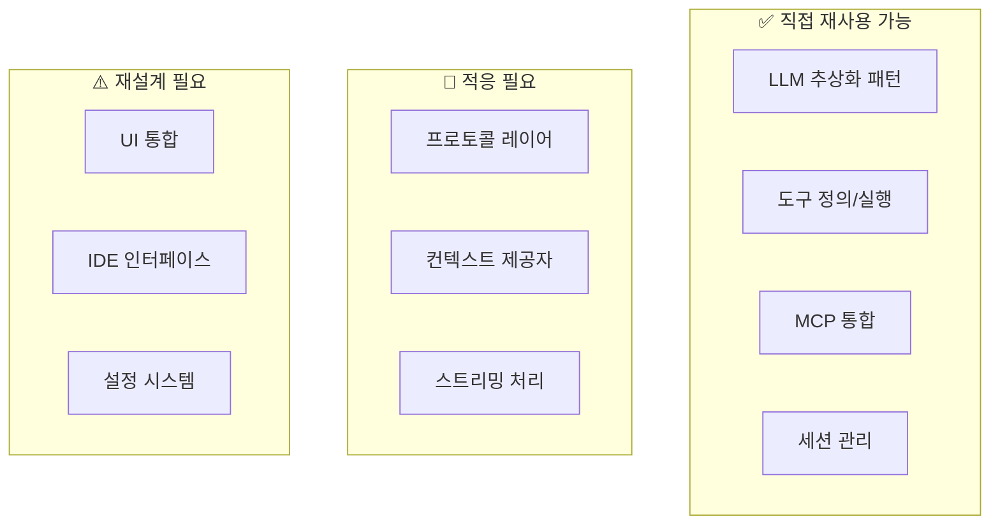

# hdsp-agent 적용 가이드

> **목적**: Continue 프로젝트 분석을 바탕으로 hdsp-agent(Jupyter Extension) 개발에 적용할 핵심 패턴과 구현 로드맵 제공

---

## 1. 아키텍처 비교

### 1.1 Continue vs hdsp-agent

| 구성요소 | Continue | hdsp-agent (권장) |
|---------|----------|------------------|
| **호스트 환경** | VS Code / JetBrains | JupyterLab |
| **프로토콜** | VS Code Extension API / IPC | Jupyter Comm / WebSocket |
| **UI 레이어** | React Webview | React + Jupyter Widgets |
| **실행 환경** | Node.js (별도 프로세스) | Jupyter Kernel (Python) |
| **패키지 관리** | npm workspaces | pip / conda |
| **언어** | TypeScript | Python + TypeScript |

### 1.2 재사용 가능한 패턴



---

## 2. 핵심 패턴 요약

### 2.1 LLM 통합 패턴

**Continue 패턴**:
```typescript
abstract class BaseLLM implements ILLM {
  abstract streamChat(messages: ChatMessage[]): AsyncGenerator<ChatMessage>;
}
```

**hdsp-agent 적용**:
```python
from abc import ABC, abstractmethod
from typing import AsyncGenerator, List

class BaseLLM(ABC):
    """LLM 추상 기본 클래스"""

    provider_name: str = ""

    @abstractmethod
    async def stream_chat(
        self,
        messages: List[ChatMessage],
        tools: Optional[List[Tool]] = None
    ) -> AsyncGenerator[ChatMessage, None]:
        pass

    async def complete(self, prompt: str) -> str:
        """단일 완성"""
        messages = [ChatMessage(role="user", content=prompt)]
        result = []
        async for chunk in self.stream_chat(messages):
            result.append(chunk.content)
        return "".join(result)
```

### 2.2 도구 시스템 패턴

**Continue 패턴**: JSON Schema 기반 도구 정의 + `callTool` 파이프라인

**hdsp-agent 적용**:
```python
from dataclasses import dataclass
from typing import Callable, Dict, Any, Optional

@dataclass
class ToolFunction:
    name: str
    description: str
    parameters: Dict[str, Any]  # JSON Schema

@dataclass
class Tool:
    function: ToolFunction
    run: Callable[[Dict[str, Any], "ToolExtras"], Any]
    policy: str = "ask"  # "ask" | "allow" | "deny"
    preprocess_args: Optional[Callable] = None

    def to_openai_format(self) -> Dict:
        return {
            "type": "function",
            "function": {
                "name": self.function.name,
                "description": self.function.description,
                "parameters": self.function.parameters
            }
        }
```

### 2.3 프로토콜 패턴

**Continue 패턴**: TypeScript 타입 기반 RPC

**hdsp-agent 적용** (Jupyter Comm 기반):
```python
from jupyter_client.comm import Comm
import json

class JupyterMessenger:
    """Jupyter Comm 기반 메신저"""

    def __init__(self, comm_target: str = "hdsp-agent"):
        self.comm_target = comm_target
        self.comm: Optional[Comm] = None
        self._handlers: Dict[str, Callable] = {}
        self._pending_requests: Dict[str, asyncio.Future] = {}

    def open(self):
        self.comm = Comm(target_name=self.comm_target)
        self.comm.on_msg(self._handle_message)
        self.comm.open({})

    def on(self, message_type: str, handler: Callable):
        """메시지 핸들러 등록"""
        self._handlers[message_type] = handler

    async def request(self, message_type: str, data: Any) -> Any:
        """요청-응답 패턴"""
        message_id = str(uuid.uuid4())
        future = asyncio.get_event_loop().create_future()
        self._pending_requests[message_id] = future

        self.comm.send({
            "type": message_type,
            "data": data,
            "messageId": message_id
        })

        return await future

    def send(self, message_type: str, data: Any):
        """단방향 메시지 전송"""
        self.comm.send({
            "type": message_type,
            "data": data
        })

    def _handle_message(self, msg):
        data = msg["content"]["data"]
        message_type = data.get("type")
        message_id = data.get("messageId")

        # 응답 처리
        if message_id in self._pending_requests:
            self._pending_requests[message_id].set_result(data.get("data"))
            del self._pending_requests[message_id]
            return

        # 핸들러 호출
        if message_type in self._handlers:
            result = self._handlers[message_type](data.get("data"))
            if message_id:
                self.comm.send({
                    "type": f"{message_type}/response",
                    "data": result,
                    "messageId": message_id
                })
```

### 2.4 컨텍스트 제공자 패턴

**Continue 패턴**: `BaseContextProvider` 추상 클래스

**hdsp-agent 적용**:
```python
class NotebookContextProvider(BaseContextProvider):
    """노트북 셀 컨텍스트"""

    description = ContextProviderDescription(
        title="cell",
        display_title="Notebook Cells",
        description="Select notebook cells",
        provider_type="submenu"
    )

    async def get_context_items(
        self,
        query: str,  # 셀 인덱스 또는 범위
        extras: ContextProviderExtras
    ) -> List[ContextItem]:
        notebook = extras.kernel.get_notebook()
        cell_indices = self._parse_cell_query(query)

        items = []
        for idx in cell_indices:
            cell = notebook.cells[idx]
            items.append(ContextItem(
                name=f"Cell {idx + 1}",
                description=cell.cell_type,
                content=f"```{cell.cell_type}\n{cell.source}\n```",
                uri_type="cell",
                uri_value=f"cell://{idx}"
            ))
        return items


class DataFrameContextProvider(BaseContextProvider):
    """DataFrame 변수 컨텍스트"""

    description = ContextProviderDescription(
        title="df",
        display_title="DataFrames",
        description="Select DataFrame variables",
        provider_type="submenu"
    )

    async def get_context_items(
        self,
        query: str,  # 변수명
        extras: ContextProviderExtras
    ) -> List[ContextItem]:
        df = extras.kernel.get_variable(query)

        if df is None:
            return []

        # DataFrame 요약 정보 생성
        summary = f"""
DataFrame: {query}
Shape: {df.shape}
Columns: {list(df.columns)}

Head:
{df.head().to_markdown()}

Info:
{df.dtypes.to_string()}
"""
        return [ContextItem(
            name=query,
            description=f"DataFrame {df.shape}",
            content=summary
        )]
```

---

## 3. 구현 로드맵

### Phase 1: 핵심 인프라 (2-3주)

#### 1.1 LLM 클라이언트 레이어
- [ ] `BaseLLM` 추상 클래스 구현
- [ ] OpenAI 호환 프로바이더 구현
- [ ] Anthropic 프로바이더 구현
- [ ] Ollama (로컬) 프로바이더 구현
- [ ] 스트리밍 응답 처리
- [ ] 에러 핸들링 및 재시도

#### 1.2 메시지 프로토콜
- [ ] Jupyter Comm 기반 `JupyterMessenger` 구현
- [ ] 메시지 타입 정의 (Python dataclass)
- [ ] 요청-응답 패턴 구현
- [ ] 스트리밍 메시지 처리

### Phase 2: 도구 시스템 (2주)

#### 2.1 도구 정의
- [ ] `Tool` 데이터 클래스 구현
- [ ] JSON Schema 기반 파라미터 정의
- [ ] 내장 도구 구현:
  - `execute_code`: 셀 실행
  - `read_file`: 파일 읽기
  - `write_file`: 파일 쓰기
  - `search_code`: 코드 검색
  - `run_terminal`: 터미널 명령

#### 2.2 도구 실행 파이프라인
- [ ] `callTool` 함수 구현
- [ ] 인자 전처리 (`preprocessArgs`)
- [ ] 정책 평가 (`evaluatePolicy`)
- [ ] 결과 후처리

### Phase 3: 컨텍스트 시스템 (2주)

#### 3.1 컨텍스트 제공자
- [ ] `BaseContextProvider` 추상 클래스
- [ ] 내장 제공자 구현:
  - `@cell`: 노트북 셀
  - `@df`: DataFrame 변수
  - `@var`: 커널 변수
  - `@file`: 파일 내용
  - `@output`: 셀 출력

#### 3.2 MCP 통합
- [ ] MCP 클라이언트 연결
- [ ] 리소스/도구 프록시
- [ ] 동적 제공자 등록

### Phase 4: 에이전트 모드 (2주)

#### 4.1 세션 관리
- [ ] `Session` 데이터 클래스
- [ ] `SessionManager` 구현
- [ ] 히스토리 저장/로드
- [ ] 세션 검색/삭제

#### 4.2 에이전트 루프
- [ ] `AgentLoop` 클래스 구현
- [ ] 4가지 모드 지원 (chat, agent, plan, background)
- [ ] 도구 승인 흐름
- [ ] 백그라운드 프로세스 관리

### Phase 5: UI 통합 (2-3주)

#### 5.1 JupyterLab Extension
- [ ] 사이드바 패널 구현
- [ ] 채팅 인터페이스
- [ ] 컨텍스트 선택 UI
- [ ] 도구 승인 다이얼로그

#### 5.2 Jupyter Widget
- [ ] 인라인 어시스턴트 위젯
- [ ] 셀 어노테이션
- [ ] 결과 프리뷰

---

## 4. 디렉토리 구조 (권장)

```
hdsp-agent/
├── hdsp_agent/                 # Python 패키지 (Kernel 측)
│   ├── __init__.py
│   ├── core/
│   │   ├── __init__.py
│   │   ├── agent.py           # 에이전트 루프
│   │   ├── session.py         # 세션 관리
│   │   └── config.py          # 설정 관리
│   │
│   ├── llm/
│   │   ├── __init__.py
│   │   ├── base.py            # BaseLLM 추상 클래스
│   │   ├── openai.py          # OpenAI 프로바이더
│   │   ├── anthropic.py       # Anthropic 프로바이더
│   │   └── ollama.py          # Ollama 프로바이더
│   │
│   ├── tools/
│   │   ├── __init__.py
│   │   ├── base.py            # Tool 정의
│   │   ├── call_tool.py       # 도구 실행 파이프라인
│   │   └── definitions/       # 내장 도구
│   │       ├── execute_code.py
│   │       ├── read_file.py
│   │       └── run_terminal.py
│   │
│   ├── context/
│   │   ├── __init__.py
│   │   ├── base.py            # BaseContextProvider
│   │   ├── providers/         # 컨텍스트 제공자
│   │   │   ├── cell.py
│   │   │   ├── dataframe.py
│   │   │   └── variable.py
│   │   └── mcp/               # MCP 통합
│   │       └── connection.py
│   │
│   ├── protocol/
│   │   ├── __init__.py
│   │   ├── types.py           # 메시지 타입 정의
│   │   └── messenger.py       # Jupyter Comm 메신저
│   │
│   └── kernel/
│       ├── __init__.py
│       └── extension.py       # IPython Extension
│
├── src/                        # TypeScript (JupyterLab Extension)
│   ├── index.ts
│   ├── components/
│   │   ├── ChatPanel.tsx
│   │   ├── ContextSelector.tsx
│   │   └── ToolApproval.tsx
│   └── protocol/
│       └── types.ts           # 프로토콜 타입 (TS)
│
├── pyproject.toml
├── package.json
└── tsconfig.json
```

---

## 5. 체크리스트

### 5.1 구현 전 확인사항

- [ ] Python 3.9+ 환경 준비
- [ ] JupyterLab 4.x 개발 환경
- [ ] OpenAI/Anthropic API 키 준비
- [ ] MCP 서버 (선택적) 설정

### 5.2 핵심 기능 검증

| 기능 | 테스트 항목 | 완료 |
|------|------------|------|
| LLM 연결 | 스트리밍 응답 수신 | ☐ |
| 도구 호출 | JSON 파싱 및 실행 | ☐ |
| 컨텍스트 | 노트북 셀 주입 | ☐ |
| 세션 | 저장/로드 동작 | ☐ |
| 프로토콜 | Comm 메시지 교환 | ☐ |

### 5.3 통합 테스트

- [ ] 전체 에이전트 루프 동작
- [ ] 도구 승인 → 실행 → 결과 표시
- [ ] 세션 지속성 검증
- [ ] 에러 복구 시나리오

---

## 6. 권장사항

### 6.1 아키텍처 원칙

1. **명확한 레이어 분리**
   - Core (비즈니스 로직) ↔ Protocol (통신) ↔ UI (표현)
   - 각 레이어는 독립적으로 테스트 가능해야 함

2. **비동기 우선 설계**
   - 모든 I/O 작업은 `async/await` 사용
   - Jupyter Kernel의 이벤트 루프와 통합

3. **확장성 고려**
   - Provider 패턴으로 LLM/Context/Tool 확장
   - MCP 통합으로 외부 도구 연동

### 6.2 성능 최적화

1. **스트리밍 처리**
   - LLM 응답은 청크 단위로 즉시 표시
   - 도구 출력도 스트리밍 지원

2. **캐싱 전략**
   - 임베딩 결과 캐싱
   - 파일 내용 캐싱 (변경 감지)
   - 세션 메타데이터 캐싱

3. **리소스 관리**
   - 토큰 카운팅으로 컨텍스트 윈도우 관리
   - 대화 요약으로 히스토리 압축

### 6.3 보안 고려사항

1. **API 키 관리**
   - 환경 변수 또는 시스템 키체인 사용
   - 코드에 직접 포함 금지

2. **도구 실행 권한**
   - 정책 기반 승인 시스템
   - 위험 명령 블랙리스트

3. **데이터 프라이버시**
   - 민감 데이터 마스킹
   - 로컬 저장 시 암호화 고려

---

## 7. 참고 자료

### Continue 핵심 파일

| 파일 | 참고 내용 |
|------|----------|
| `core/llm/index.ts` | LLM 추상화 패턴 |
| `core/tools/callTool.ts` | 도구 실행 파이프라인 |
| `core/context/index.ts` | 컨텍스트 제공자 베이스 |
| `core/protocol/core.ts` | 프로토콜 타입 정의 |
| `core/core.ts` | 메인 오케스트레이션 |
| `core/context/mcp/MCPConnection.ts` | MCP 클라이언트 |

### 분석 문서

| 문서 | 내용 |
|------|------|
| [01-프로젝트-개요.md](./01-프로젝트-개요.md) | 전체 아키텍처 |
| [02-LLM-통합-패턴.md](./02-LLM-통합-패턴.md) | LLM 추상화 |
| [03-프로토콜-통신.md](./03-프로토콜-통신.md) | 메시지 프로토콜 |
| [04-도구-시스템.md](./04-도구-시스템.md) | Tool Calling |
| [05-컨텍스트-제공자.md](./05-컨텍스트-제공자.md) | Context Provider |
| [06-에이전트-모드.md](./06-에이전트-모드.md) | 에이전트 실행 루프 |

---

## 8. 결론

Continue 프로젝트는 성숙한 AI 코딩 어시스턴트로, hdsp-agent 개발에 많은 인사이트를 제공합니다.

**직접 적용 가능한 패턴**:
- LLM 추상화 (BaseLLM)
- 도구 정의/실행 파이프라인
- 컨텍스트 제공자 아키텍처
- 세션/히스토리 관리
- MCP 통합

**재설계가 필요한 영역**:
- Jupyter Comm 기반 프로토콜
- 노트북 특화 컨텍스트 제공자
- JupyterLab Extension UI

핵심은 Continue의 **Provider 패턴**과 **타입 안전 프로토콜**을 Python/Jupyter 환경에 맞게 적응하는 것입니다. 이 가이드를 따라 단계적으로 구현하면 견고한 Jupyter AI 어시스턴트를 구축할 수 있습니다.
